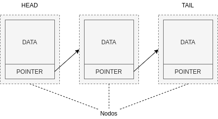

When we hear the word _blockchain_, we automatically think of Bitcoin or Cryptocurrencies, however _blockchain_ is, no more and no less, a type of **data structure**.

===

First of all, let's define what a data structure is:

> _A data structure is a way of storing, organising and managing data. It allows us to access, add, modify and search the data it contains._

There are many types of data structures, such as _arrays_ or _linked lists_.

A linked list is made up of nodes that contain information. A node consists of at least one data object and a pointer to the next node in the list. The pointer serves as a link to the next node in the list.



One of the characteristics of linked lists is that it is necessary to traverse them to find the desired data, since it is necessary to know the pointer to access each node.

A **block chain** is very similar to linked lists but unlike linked lists, it is composed of blocks instead of nodes, these blocks are immutable, that is, once defined they cannot be changed. Also instead of a pointer they have a unique hash that references the previous block.


The most important difference between blockchains and linked lists is that each reference in a blockchain is cryptographically secured.

These references or hashes are calculated based on various elements of the block such as the content and the timestamp. For this we can use various <a href="https://en.wikipedia.org/wiki/List_of_hash_functions#Unkeyed_cryptographic_hash_functions" target="_blank" rel="nofollow">cryptographic algorithms</a> like <a href="https://en.wikipedia.org/wiki/SHA-2" target="_blank" rel="nofollow">SHA256</a>, always taking into account the following requirements:

- **Unidirectional**: it must be easy to calculate an output from a given input but impossible to calculate the input from a given output.
- **Pseudorandom**: a change in the input must result in an unpredictable change in the output.
- **Collision Resistant**: It should be difficult to find two inputs to a hash function that produce the same output.
- **Deterministic**: given an input we will always obtain the same output.

Using these references or hashes in blockchains allows us to perform integrity checks on the blockchain, ensuring that no blocks have been altered. However, it also prevents us from introducing new blocks in the middle of the chain, leaving us only the possibility of adding new blocks at the end of it.

Now that we know the basics of a blockchain, let's look at a very simple example of a block:

```php
class Block
{
    public $data;
    public $timestamp;
    public $previousHash;
    public $hash;

    public function __construct(string $data, ?Block $previous = null)
    {
        $this->data = $data;
        $this->timestamp = date('U');
        $this->previousHash = $previous ? $previous->hash : null;
        $this->hash = $this->calculateHash();
    }

    public function calculateHash(): string
    {
        return hash("sha256", $this->timestamp . $this->data . $this->previousHash);
    }
}
```

As we can see, it is very simple, a block accepts some data, in this case it is a text string, it can also accept a previous block that it will use to obtain the previous hash. The algorithm used to calculate the hash is <a href="https://en.wikipedia.org/wiki/SHA-2" target="_blank" rel="nofollow">SHA256</a> to which it is passed as an argument the concatenation of the timestamp, the data and the previous hash.

Let's now look at an example of the blockchain itself:

```php
class BlockChain
{
    private $blocks = [];

    public function __construct()
    {
        $this->blocks[] = new Block('Genesis');
    }

    public function add(string $data): void
    {
        $this->blocks[] = new Block($data, $this->last());
    }

    public function last(): Block
    {
        if (!empty($this->blocks)) {
            foreach (array_reverse($this->blocks) as $block) {
                return $block;
            }
        }

        return null;
    }

    public function isValid(): bool
    {
        foreach ($this->blocks as $idx => $block) {
            if ($idx != 0 && $this->blocks[$idx - 1]->hash != $block->previousHash) {
                return false;
            }
        }

        return true;
    }
}
```

Every blockchain must have an initial block known as the "_genesis_" block, this will be created automatically when the new blockchain is instantiated. Every time new data is added to our chain, a new block is created that contains it. Verifying the chain is very simple, we just have to go through it, checking that each block contains the hash of the previous block.

```php
$chain = new BlockChain();
$chain->add('data for 2nd block');
$chain->add('data for 3th block');

var_dump($chain->isValid());
bool(true)
```

To summarize we can say that:

- Blockchain is a method of storing data.
- The elements of a blockchain, its blocks, are cryptographically linked.
- Blocks cannot be added in the middle of the chain, only at the end.
- You cannot change the data after it has been registered in the block.
- Integrity checks can be performed on the blockchain.
- Useful for scenarios in which it is required to store data chronologically ordered, without the possibility of alteration and whose trust is going to be distributed instead of residing in a centralized certifying entity.
