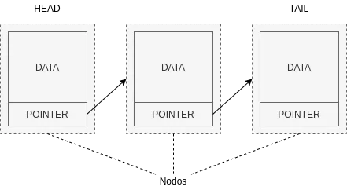
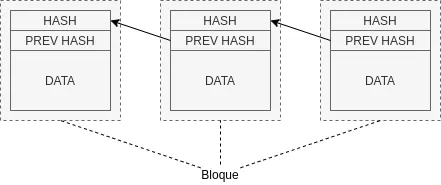

Cuando escuchamos la palabra _blockchain_, automáticamente pensamos en Bitcoin o en Cryptomonedas, sin embargo _blockchain_ o cadena de bloques es, ni mas ni menos, un tipo de **estructura de datos**.

===

Antes de nada definamos lo que es una estructura de datos:

> _Una estructura de datos es una forma de almacenar, organizar y administrar datos. Nos permite acceder, agregar, modificar y buscar los datos que contiene._

Existen muchos tipos de estructuras de datos, tales como _arrays_ o _listas enlazadas_.

Una lista enlazada esta formada por nodos que contienen información. Un nodo esta compuesto como mínimo por un objeto de datos y un puntero al siguiente nodo de la lista. El puntero sirve de enlace con el siguiente nodo de la lista.



Una de las características de las listas enlazadas es que es necesario recorrerlas para encontrar el dato deseado ya que se requiere conocer el puntero para acceder a cada nodo.

Una **cadena de bloques** es muy similar a las listas enlazadas pero a diferencia de esta, esta compuesta por bloques en vez de nodos, estos bloques son inmutables, es decir, una vez definidos no pueden ser cambiados. También en vez de un puntero tienen un hash único que hace referencia al bloque anterior.


    
La diferencia mas importante entre las **cadenas de bloques** y las listas enlazadas es que cada referencia en una cadena de bloques, está criptográficamente asegurada.

Estas referencias o hashes se calculan en base a varios elementos del bloque como el contenido y la marca de tiempo. Para esto podemos usar varios <a href="https://en.wikipedia.org/wiki/List_of_hash_functions#Unkeyed_cryptographic_hash_functions" target="_blank" rel="nofollow">algoritmos criptograficos</a> como <a href="https://en.wikipedia.org/wiki/SHA-2" target="_blank" rel="nofollow">SHA256</a>, teniendo siempre en cuenta los siguientes requisitos:

- **Unidireccional**: tiene que ser fácil calcular una salida de una entrada dada pero imposible calcular la entrada de una salida dada.
- **Pseudoaleatorio**: un cambio en la entrada debe dar como resultado un cambio imprevisible de la salida.
- **Resistente a colisiones**: debe ser difícil encontrar dos entradas para una función hash que produzca la misma salida.
- **Determinista**: dada una entrada siempre obtendremos la misma salida.

El uso de estas referencias o hashes en las cadenas de bloques nos permite realizar verificaciones de integridad de la cadena de bloques, asegurándonos de que ningún bloque ha sido alterado. Sin embargo, también, nos impide introducir nuevos bloques en mitad de la cadena dejándonos solo la posibilidad de añadir nuevos bloques al final de la misma.

Ahora que conocemos los aspectos básicos de una cadena de bloques, vamos a ver un ejemplo muy sencillo de un bloque:

```php
class Block
{
    public $data;
    public $timestamp;
    public $previousHash;
    public $hash;

    public function __construct(string $data, ?Block $previous = null)
    {
        $this->data = $data;
        $this->timestamp = date('U');
        $this->previousHash = $previous ? $previous->hash : null;
        $this->hash = $this->calculateHash();
    }

    public function calculateHash(): string
    {
        return hash("sha256", $this->timestamp . $this->data . $this->previousHash);
    }
}
```

Como podemos ver es muy simple, un bloque acepta unos datos, en este caso es una cadena de texto, también puede aceptar un bloque previo que usara para obtener el hash previo. El algoritmo usado para calcular el hash es <a href="https://en.wikipedia.org/wiki/SHA-2" target="_blank" rel="nofollow">SHA256</a> al cual se le pasa como argumento la concatenación de la estampa de tiempo, los datos y el hash previo.

Veamos ahora un ejemplo de la cadena de bloques en sí:

```php
class BlockChain
{
    private $blocks = [];

    public function __construct()
    {
        $this->blocks[] = new Block('Genesis');
    }

    public function add(string $data): void
    {
        $this->blocks[] = new Block($data, $this->last());
    }

    public function last(): Block
    {
        if (!empty($this->blocks)) {
            foreach (array_reverse($this->blocks) as $block) {
                return $block;
            }
        }

        return null;
    }

    public function isValid(): bool
    {
        foreach ($this->blocks as $idx => $block) {
            if ($idx != 0 && $this->blocks[$idx - 1]->hash != $block->previousHash) {
                return false;
            }
        }

        return true;
    }
}
```

Toda cadena de bloques debe de tener un bloque inicial conocido como el bloque "_génesis_", este se creara automáticamente cuando se instancie la nueva cadena de bloques. Cada vez que se añaden datos nuevos a nuestra cadena se crea un bloque nuevo que los contiene. La verificación de la cadena es muy sencilla, solo tenemos que recorrerla comprobado que cada bloque contiene el hash del bloque previo.

```php
$chain = new BlockChain();
$chain->add('data for 2nd block');
$chain->add('data for 3th block');

var_dump($chain->isValid());
bool(true)
```

Para resumir podemos decir que:

- La cadena de bloques es un método para almacenar datos.
- Los elementos de una cadena de bloques, sus bloques, están vinculados criptográficamente.
- No se pueden añadir bloques en mitad de la cadena, solo al final.
- No se puede cambiar los datos después de que se haya registrado en el bloque.
- Se pueden realizar verificaciones de integridad sobre la cadena de bloques.
- Útiles para escenarios en los que se requiera almacenar datos cronológicamente ordenados, sin posibilidad de alteración y cuya confianza vaya a ser distribuida en lugar de residir en una entidad certificadora centralizada.
