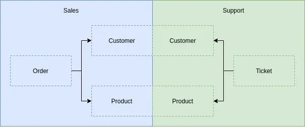

A critical aspect when implementing DDD is the correct definition of the Bounded Context (_Contextos Acotados_ in Spanish). This will allow us, in turn, to define the aggregates and other elements of our system. Ubiquitous Language plays a decisive role in defining each of our bounded contexts.

===

### The Problem

Let's start by defining what bounded contexts are:

> They are logical limits where a domain is fully defined.

What do we mean by "the domain"? The _domain_ is the universe of the business you are working with in addition to the problems you want to solve. Typically, every business has existing rules, processes, and systems that must be integrated as part of the solution. The _domain_ is also the ideas, knowledge, and data of the problem you are trying to solve. Most companies have terms that have a specific meaning within the context of their organization. They likely also have metrics, goals, and objectives that are unique to their business.

Perfect but how do we define our domain? The answer is easy, using the ubiquitous language. Each domain has its own ubiquitous language that is meaningless in other domains.

For example, suppose we are developing a book sales platform, when we talk to business (**sales**) they tell us that a _Customer_ can place _Purchase Orders_ that in turn contains certain _Products_. Another business member tells us that in **support** _Customers_ open _Tickets_ related to _Products_ they have purchased. We can see that in the sales department they talk about _Customers_, _Orders_ and _Products_, in turn, in the support department they also talk about _Customers_ and _Products_ in addition to _Tickets_ but they do not talk about _Orders_. As we continue with the conversation we see that there are more and more non-common terms between support people and sales people, that is, each one uses their own jargon or business language, or for us, their ubiquitous language. Now that we have identified each ubiquitous language we can define the domain of each one, for example:

We observe that both _Customers_ and _Products_ are repeated in both domains. Each one has a representation within each context. A _Customer_ for the Sales department will contain your personal data, purchase history, payment data, etc. However, for the Support department, payment data is not necessary, but they will need the purchase history in addition to the history of open tickets. The same entity has several representations depending on the point of view or the **context** in which it is found.

### The Solution

The _model_ in every project is the solution to the problem posed by the business. Generally, it represents an aspect of reality or something of interest, and focuses on knowledge of a specific problem, which is simplified and structured to provide a solution. The _domain model_ is your organized and structured knowledge of the problem.

The domain model must represent the vocabulary and key concepts of the problem, it must also identify the relationships between all entities within the scope of the domain. The _domain model_ should act as a clear description of the problem being solved and the proposed solution. It is extremely important that all project stakeholders contribute to the _domain model_ so that everyone understands the key concepts, vocabulary definitions, and how the problem is approached and solved.

### Conclusion

A bounded context is a logical division where a business problem and its solution are **fully defined**. It allows us to break down a big problem into much smaller problems, so we can focus on particular aspects of the application while ignoring everything else. We can use consistent language around that specific problem, so that we all have a clear definition of each of the important terms.

Typically, certain objects in an application have different definitions in different contexts. By dividing the application into bounded context, we ensure that the lines between each context are clearly defined, so that the terminology around the ideas and concepts of the application are clearly understood.

### Related Books

- [Domain-Driven Design: Tackling Complexity in the Heart of Software](https://amzn.to/3cqJyT2) 
- [Implementing Domain-Driven Design](https://amzn.to/3evedjW) 
- [Domain- Driven Design Destilado](https://amzn.to/2RNv9sg)
