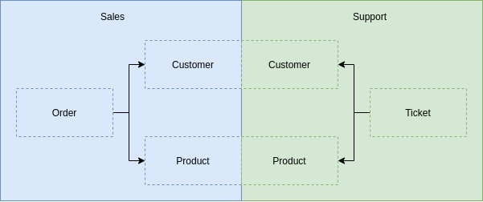

Un aspecto crítico a la hora de implementar DDD es la correcta definición de los Bounded Context (_Contextos Acotados_ en español). Esto nos permitirá, a su vez, definir los agregados y demás elementos de nuestro sistema. El Lenguaje Ubicuo juega un papel decisivo a la hora de definir cada uno de nuestros bounded context.

===

### El Problema 

Empecemos por definir que son los bounded context: 

> Son límites lógicos donde un dominio está totalmente definido. 

Qué queremos decir con "el dominio"? El _dominio_ es el universo del negocio con el que se está trabajando además de los problemas que quiere resolver. Por lo general, todo negocio tiene reglas, procesos y sistemas existentes que deben integrarse como parte de la solución. El _dominio_ también son las ideas, el conocimiento y los datos del problema que se está tratando de resolver. La mayoría de las empresas tienen términos que tienen un significado específico dentro del contexto de su organización. Es probable que también tengan métricas, metas y objetivos que sean exclusivos de su negocio. 

Perfecto pero, ¿cómo definimos nuestro dominio? La respuesta es fácil, usando el lenguaje ubicuo. Cada dominio tiene su propio lenguaje ubicuo que carece de sentido en otros dominios. 

Por ejemplo, supongamos que estamos desarrollando una plataforma de venta de libros, cuando hablamos con negocio (**ventas**) nos comentan que un _Cliente_ puede realizar _Órdenes_ de compra que a su vez contiene ciertos _Productos_. Otro de los integrantes de negocio nos comenta que en **soporte** los _Clientes_ abren _Tickets_ relacionados con _Productos_ que han comprado. Podemos ver que en el departamento de ventas hablan de _Clientes_, _Órdenes_ y _Productos_, a su vez, en el departamento de soporte hablan también de _Clientes_ y _Productos_ además de _Tickets_ pero no hablan de _Órdenes_. Al continuar con la conversación vemos que existen cada vez más términos no comunes entre la gente de soporte y la gente de ventas, es decir, cada uno usa su propia jerga o lenguaje de negocio, o para nosotros, su lenguaje ubicuo. Ahora que tenemos identificado cada lenguaje ubicuo podemos definir el dominio de cada uno, por ejemplo:

Observamos qué, tanto _Clientes_ como _Productos_, están repetidos en ambos dominios. Cada uno, cuenta con una representación dentro de cada contexto. Un _Cliente_ para el departamento de Ventas contendrá sus datos personales, su historial de compra, datos de pago, etc. Sin embargo, para el departamento de Soporte los datos de pago no son necesarios, pero si necesitará el historial de compra además del historial de tickets abiertos. Una misma entidad tiene varias representaciones dependiendo del punto de vista o del **contexto** en el que se encuentre. 

### La Solución 

El _modelo_ en todo proyecto es la solución al problema planteado por el negocio. Generalmente, representa un aspecto de la realidad o algo de interés, y se centra en el conocimiento de un problema específico, que se simplifica y estructura para proporcionar una solución. El _modelo de dominio_ es su conocimiento organizado y estructurado del problema. 

El modelo de dominio debe representar el vocabulario y los conceptos clave del problema, también debe identificar las relaciones entre todas las entidades dentro del alcance del dominio. El _modelo de dominio_ debe actuar como una descripción clara del problema que se está resolviendo y la solución propuesta. Es extremadamente importante que todas las partes interesadas del proyecto contribuyan al _modelo de dominio_ para que todos comprendan los conceptos clave, las definiciones del vocabulario y, cómo se aborda y resuelve el problema. 

### Conclusión 

Un bounded context es una división lógica donde un problema de negocio y su solución están **totalmente definidas**. Nos permite dividir un gran problema en problemas mucho más pequeños, para que podamos concentrarnos en aspectos particulares de la aplicación mientras ignoramos todo lo demás. Podemos usar un lenguaje coherente en torno a ese problema específico, para que todos tengamos una definición clara de cada uno de los términos importantes. 

Por lo general, ciertos objetos en una aplicación tienen diferentes definiciones en distintos contextos. Al dividir la aplicación en bounded context, nos aseguramos de que las líneas entre cada contexto estén claramente definidas, para que la terminología en torno a las ideas y conceptos de la aplicación se entiendan claramente. 

### Libros Relacionados 

- [Domain-Driven Design: Tackling Complexity in the Heart of Software](https://amzn.to/3cqJyT2) 
- [Implementing Domain-Driven Design](https://amzn.to/3evedjW) 
- [Domain- Driven Design Destilado](https://amzn.to/2RNv9sg)
