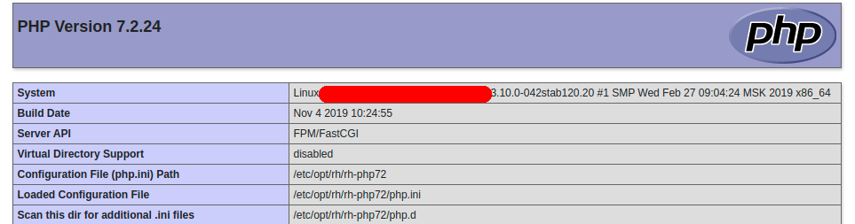

PHP-FPM, or PHP FastCGI Process Manager, is an alternative implementation of PHP FastCGI that can handle a high volume of queries. Combined with PHP 7, PHP-FPM achieves a higher level of performance than any previous version of PHP.

===

When PHP is run as an Apache2 module (httpd), each worker process is a copy of the master process's memory space. This implies that in each worker it doubles the memory space used to execute PHP even if it is not necessary.

When using PHP-FPM, the PHP interpreter runs as a separate service, which can receive requests over a TCP/IP or traditional UNIX socket. In this way there are two services: Apache2 (httpd) to manage the HTTP protocol and PHP-FPM to interpret PHP code. This is more efficient, since PHP is executed only when necessary.

Now that we know a little more about PHP FPM, it is time to install and configure it.

First we must install the version of PHP that we want, for this we can see the article [Installing PHP 5.6, 7.0, 7.1 and 7.2 on CentOS/RHEL 7](/blog/installing-php-5-6-7-0-7-1-and-7-2-on-centos-rhel-7), in this example we will use the PHP version `rh-php72`. We will also need the Apache2 server (httpd).

```bash
yum install httpd mod_ssl
```

Once we have everything installed we start by configuring the httpd mpm module in the file `/etc/httpd/conf.modules.d/00-mpm.conf`:

```bash
LoadModule mpm_event_module modulese/mod_mpm_event.so
```

If we want to make any changes to the **PHP FPM** module we only have to edit the `/etc/opt/rh/rh-php72/php-fpm.conf` file.

Additionally, we can make changes to the process pool configuration in the file `/etc/opt/rh/rh-php72/php-fpm.d/www.conf`.

Once the changes have been made, we must restart the PHP FPM service to apply the changes.

```bash
systemctl restart rh-php72-php-fpm.service
```

We must also restart the httpd service to apply the changes to the mpm module:

```bash
systemctl restart httpd
```

Finally we must add the following line to our vhosts:

```bash
<FilesMatch \.php$>
SetHandler "proxy:fcgi://127.0.0.1:9000"
</FilesMatch>
```

We can confirm that we are running PHP with PHP FPM with a simple `phpinfo()`;

