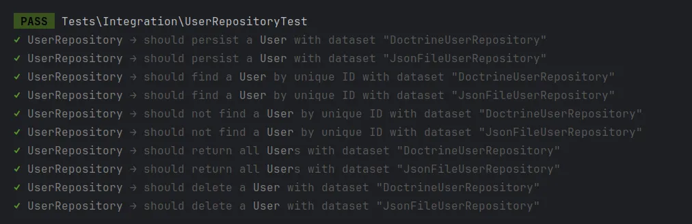

Ensuring that infrastructure services, like Repositories or Cache implementations, are reliable is crucial for building sturdy software. In our previous post, [Testing Services in Hexagonal Architecture](/blog/testing-services-in-hexagonal-architecture), we talked about unit testing. Now, let's dive into contract testing to check how infrastructure services works with services from other layers. By making sure that different implementations stick to their contracts consistently, we can keep the system reliable without needing complicated setups. This method helps make sure infrastructure services are dependable and that everything integrates smoothly throughout the system.

===

While contract testing is usually used for assessing different services like HTTP APIs, we can also use it to focus on smaller parts, like classes or modules. By applying contract testing, we validate that all implementations can be substituted interchangeably, ensuring that they meet the expected behavior outlined in the contract. This not only enhances system reliability but also simplifies maintenance and scalability.

All implementations must pass the same test cases, ensuring that each one meets the exact requirements defined by the contract. This means that every implementation must produce the same results under identical conditions, guaranteeing consistent behavior across the system.

## Test Cases

The initial test case will focus on the `save` method, which accepts a `User` instance (without an ID for new users) and returns a `User` instance with a valid ID.

```php
interface UserRepository  
{  
	// ...

    public function save(User $user): User;  

	// ...
}
```

The test case will look something like this: 

```php
test('should persist a `User`', function (string $type) {
	$repository = $this->makeRepository($type, 'save');

	$user = $repository->save(User::create('Vincent Vega'));

	expect($user)->toBeInstanceOf(User::class)
		->and($user->name)->toBeString('Vincent Vega')
		->and($user->id())->toBeGreaterThan(0);

	$this->persistenceClean($type, 'save');
});
```

Let's break down what's happening in the example above:

- First, we need to create an instance of the `UserRepository`. We achieve this using the `makeRepository` method, which takes the repository class name and a string identifying the context. Context is crucial as each test case must be entirely isolated and independent from others. Here, we use the string `save` to establish a context specifically for the `save` test case.
- Once we have the repository, we can instantiate a new `User` object and use it to invoke the `save` method.
- Next, we need to verify the returned `User` instance, first we assert the name as valid string, next the ID as positive integer greater that 0.
- Finally, we perform a cleanup of the persistence layer scoped by context.

In this scenario, the test case is parameterized to inject various implementations as datasets. By doing so, we ensure that each implementation is tested against the same set of expectations, defined by the contract. This approach guarantees that regardless of the specific implementation being tested, they all adhere to the contract's requirements. As a result, we can confidently assert that all implementations behave uniformly under the same conditions, maintaining consistency and reliability across the board.

The next test case covers the `find` method that takes an integer as ID and returns a `User` instance if the ID matches a user, or `null` if no user is found.

```php
interface UserRepository  
{  
	// ...

    public function find(int $id): ?User;

	// ...
}
```

The test case will look something like this:

```php
test('should find a `User` by unique ID', function (string $type) {  
    $this->persistenceSeed($type, 'find', [  
        ['id' => 1, 'name' => 'Vincent Vega']  
    ]);  
  
    $repository = $this->makeRepository($type, 'find');  
    $user = $repository->find(1);  
  
    expect($user)->toBeInstanceOf(User::class)  
        ->and($user->name)->toBeString()  
        ->and($user->id())->toBeInt();  
  
    $this->persistenceClean($type, 'find');  
});
```

In this example, we introduce a new helper method called `persistenceSeed`. It takes three parameters: the implementation type, the context, and either a positive integer or an array. If an integer is provided, the method generates that number of fake users and inserts them into the persistence layer. If an array is provided, it must contain the data for each fake user. In this specific case, we're injecting one user with the ID `1` and the name `Vincent Vega` into the persistence layer.

Let's further dissect the test case:

- Initially, we populate the persistence layer with new user data.
- Then, we acquire a repository instance within the defined context.
- Following that, we invoke the `find` method using the same ID we injected earlier.
- Subsequently, we verify that the output corresponds to the previously injected user data.
- Lastly, we clear the persistence layer within the established context.

Now, we need to test the second use case of the `find` method. In this new test case, we'll verify that when the provided ID doesn't match any user, the return value must be `null`.

```php
test('should not find a `User` by unique ID', function (string $type) {  
    $repository = $this->makeRepository($type, 'notfind');  
    $user = $repository->find(1);  
  
    expect($user)->toBeNull();  
});
```

Since this test doesn't require injecting any data into the persistence layer, we can omit the persistence cleanup step.

Let's proceed to the `all` method, which doesn't take any arguments and returns an array containing all the `User`s from the persistence layer.

```php
interface UserRepository  
{  
	// ...

    public function all(): array;

	// ...
}
```

The test case will look something like this:

```php
test('should return all `User`s', function (string $type) {  
    $this->persistenceSeed($type, 'all', 3);  
  
    $repository = $this->makeRepository($type, 'all');  
    $all = $repository->all();  
  
    expect($all)->toBeArray()  
        ->and($all)->toHaveCount(3)  
        ->and($all)->each->toBeInstanceOf(User::class);  
  
    $this->persistenceClean($type, 'all');  
});
```

In this scenario, we utilize the `persistenceSeed` method with an integer argument to instruct it to create three random users in the persistence layer.

- First, we seed the persistence layer with three users.
- Next, we retrieve the repository instance and invoke the `all` method.
- Then, we assert that the returned array contains three items, all of which are instances of `User`.
- Finally, we perform cleanup on the persistence layer.

## Helpers

As we mention before we have used some helpers functions to help us on the testing process:

- `persistenceSeed`: create data into the persistence layer. 
- `makeRepository`: creates a new repository based on the type request.
- `persistenceClean`: cleans the persistence layer.

The key in that all these methods accepts the type of repository you are using, so the single function can interact with different persistence layers depending on the type required. You can check the implementation of this helpers [here](https://github.com/othercodes/hexagonal-architecture-example-in-php/blob/master/tests/TestCase.php#L27). 

## Hooks

Hooks allow you to perform specific actions before and after each test or file, such as setting up test data, initializing the test environment, or cleaning up resources after the tests are complete. So why don't we use them? The problem is that hooks are not parameterized, meaning we can't retrieve the type of repository for each test execution. 

Ideally, we would want something like:

```php
afterEach(function (string $type, string $context) {
	$this->persistenceClean($type, $context);
});
```

Unfortunately, we can't do that, so we execute this helpers in the actual test case.

## Test Case Execution

Now that we have all the test cases ready, we need to inject the implementation types into each test. For this, we will utilize the [dataset](https://pestphp.com/docs/datasets) feature.

```php
describe('UserRepository', function () {

	// test cases goes here

})->with([  
    'DoctrineUserRepository' => [DoctrineUserRepository::class],  
]);
```

Let's run the test.


We can see that all the tests pass successfully. Now, let's add a second implementation of our `UserRepository`. In this case, we will create a simple implementation that uses JSON files to store the users. This will allow us to test our contract further by ensuring that different storage mechanisms can be seamlessly integrated while maintaining consistent behavior, you can check the code [here](https://github.com/othercodes/hexagonal-architecture-example-in-php/blob/master/src/UserManagement/Infrastructure/Persistence/JsonFileUserRepository.php).

Now let's add this implementation to the integration tests.

```php
describe('UserRepository', function () {

	// test cases goes here

})->with([  
    'DoctrineUserRepository' => [DoctrineUserRepository::class],  
    'JsonFileUserRepository' => [JsonFileUserRepository::class],  
]);
```

Let's run them again and see if the new integrations works fine: 



As we can see, the test cases are now executed for both implementations. This eliminates the need to duplicate test cases for each implementation. As mentioned before, every new implementation must pass the defined test cases since they are designed based on the contract, not the specific implementation. By doing this, we are effectively testing the contract itself, ensuring that any implementation adhering to the contract behaves as expected. This approach maintains consistency and reliability across different implementations, making our testing process more efficient and robust.

## Conclusion

In conclusion, contract testing is an essential practice for ensuring the reliability of infrastructure services. By defining and adhering to clear contracts, we can verify that different implementations, such as repositories or cache systems, behave consistently. This method streamlines the testing process and ensures comprehensive coverage of service interactions. By focusing on contracts, we ensure seamless integration and reliability across the entire system, making our infrastructure services more resilient and easier to manage.

Featured image: [https://www.pexels.com/photo/crop-colleagues-shaking-hands-in-office-5673488/]