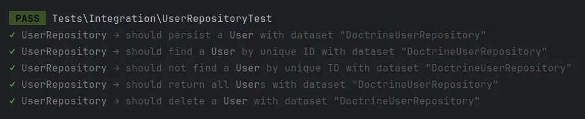
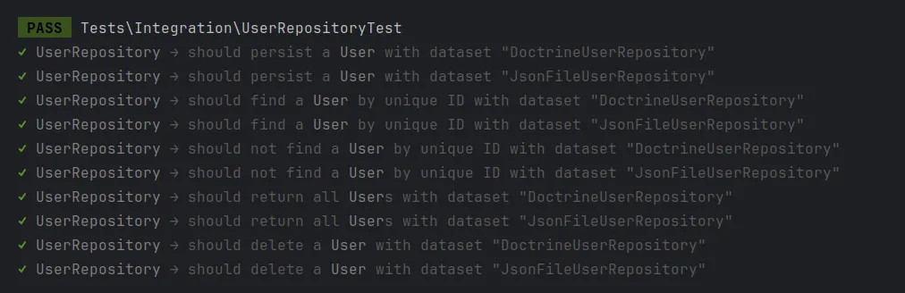

Garantizar que los servicios de infraestructura, como los Repositorios o las implementaciones de Cache, sean confiables es crucial para construir software robusto. En nuestro post anterior, [Pruebas de Servicios en Arquitectura Hexagonal](/es/blog/testeando-servicios-en-arquitectura-hexagonal), hablamos sobre pruebas unitarias. Ahora, profundicemos en las pruebas de contrato para verificar cómo los servicios de infraestructura funcionan con servicios de otras capas. Al asegurarnos de que diferentes implementaciones se adhieran consistentemente a sus contratos, podemos mantener el sistema confiable sin necesidad de configuraciones complicadas. Este método ayuda a asegurar que los servicios de infraestructura sean fiables y que todo se integre sin problemas en todo el sistema.

===

Aunque las pruebas de contrato generalmente se utilizan para evaluar diferentes servicios como APIs HTTP, también podemos usarlas para enfocarnos en partes más pequeñas, como clases o módulos. Al aplicar pruebas de contrato, validamos que todas las implementaciones puedan ser sustituidas de manera intercambiable, asegurando que cumplan con el comportamiento esperado definido en el contrato. Esto no solo mejora la confiabilidad del sistema, sino que también simplifica el mantenimiento y la escalabilidad.

Todas las implementaciones deben pasar los mismos casos de prueba, asegurando que cada una cumpla con los requisitos exactos definidos por el contrato. Esto significa que cada implementación debe producir los mismos resultados bajo condiciones idénticas, garantizando un comportamiento consistente en todo el sistema.

## Casos de Prueba

El caso de prueba inicial se centrará en el método `save`, que acepta una instancia de `User` (sin un ID para nuevos usuarios) y devuelve una instancia de `User` con un ID válido.

```php
interface UserRepository  
{  
	// ...

    public function save(User $user): User;  

	// ...
}
```

El caso de prueba se verá algo así:

```php
test('should persist a `User`', function (string $type) {
	$repository = $this->makeRepository($type, 'save');

	$user = $repository->save(User::create('Vincent Vega'));

	expect($user)->toBeInstanceOf(User::class)
		->and($user->name)->toBeString('Vincent Vega')
		->and($user->id())->toBeGreaterThan(0);

	$this->persistenceClean($type, 'save');
});
```

Desglosamos lo que ocurre en el ejemplo anterior:

- Primero, necesitamos crear una instancia de `UserRepository`. Logramos esto utilizando el método `makeRepository`, que toma el nombre de la clase del repositorio y una cadena que identifica el contexto. El contexto es crucial, ya que cada caso de prueba debe estar completamente aislado e independiente de los demás. Aquí, utilizamos la cadena `save` para establecer un contexto específicamente para el caso de prueba del método `save`.
- Una vez que tenemos el repositorio, podemos instanciar un nuevo objeto `User` y usarlo para invocar el método `save`.
- A continuación, necesitamos verificar la instancia de `User` devuelta; primero verificamos que el nombre sea una cadena válida, luego que el ID sea un número entero positivo mayor que 0.
- Finalmente, realizamos una limpieza de la capa de persistencia, delimitada por el contexto.

En este escenario, el caso de prueba está parametrizado para inyectar diversas implementaciones como conjuntos de datos. Al hacerlo, nos aseguramos de que cada implementación se pruebe contra el mismo conjunto de expectativas, definidas por el contrato. Este enfoque garantiza que, independientemente de la implementación específica que se esté probando, todas cumplan con los requisitos del contrato. Como resultado, podemos afirmar con confianza que todas las implementaciones se comportan de manera uniforme bajo las mismas condiciones, manteniendo la consistencia y la fiabilidad en todo el sistema.

El siguiente caso de prueba cubre el método `find`, que toma un número entero como ID y devuelve una instancia de `User` si el ID coincide con un usuario, o `null` si no se encuentra ningún usuario.

```php
interface UserRepository  
{  
	// ...

    public function find(int $id): ?User;

	// ...
}
```

El caso de prueba se verá algo así:

```php
test('should find a `User` by unique ID', function (string $type) {  
    $this->persistenceSeed($type, 'find', [  
        ['id' => 1, 'name' => 'Vincent Vega']  
    ]);  
  
    $repository = $this->makeRepository($type, 'find');  
    $user = $repository->find(1);  
  
    expect($user)->toBeInstanceOf(User::class)  
        ->and($user->name)->toBeString()  
        ->and($user->id())->toBeInt();  
  
    $this->persistenceClean($type, 'find');  
});
```

En este ejemplo, introducimos un nuevo método auxiliar llamado `persistenceSeed`. Este método acepta tres parámetros: el tipo de implementación, el contexto y un número entero positivo o un array. Si se proporciona un entero, el método genera esa cantidad de usuarios ficticios y los inserta en la capa de persistencia. Si se proporciona un array, debe contener los datos para cada usuario ficticio. En este caso específico, estamos inyectando un usuario con el ID `1` y el nombre `Vincent Vega` en la capa de persistencia.

Desglosamos aún más el caso de prueba:

- Inicialmente, poblamos la capa de persistencia con nuevos datos de usuario.
- Luego, obtenemos una instancia del repositorio dentro del contexto definido.
- Después, invocamos el método `find` utilizando el mismo ID que inyectamos anteriormente.
- Posteriormente, verificamos que la salida corresponda con los datos del usuario inyectado previamente.
- Finalmente, limpiamos la capa de persistencia dentro del contexto establecido.

Ahora, necesitamos probar el segundo caso de uso del método `find`. En este nuevo caso de prueba, verificaremos que cuando el ID proporcionado no coincide con ningún usuario, el valor de retorno debe ser `null`.

```php
test('should not find a `User` by unique ID', function (string $type) {  
    $repository = $this->makeRepository($type, 'notfind');  
    $user = $repository->find(1);  
  
    expect($user)->toBeNull();  
});
```

Dado que esta prueba no requiere inyectar ningún dato en la capa de persistencia, podemos omitir el paso de limpieza de la persistencia.

Continuemos con el método `all`, que no recibe ningún argumento y devuelve un array que contiene todos los `User` de la capa de persistencia.

```php
interface UserRepository  
{  
	// ...

    public function all(): array;

	// ...
}
```

El caso de prueba se verá algo así:

```php
test('should return all `User`s', function (string $type) {  
    $this->persistenceSeed($type, 'all', 3);  
  
    $repository = $this->makeRepository($type, 'all');  
    $all = $repository->all();  
  
    expect($all)->toBeArray()  
        ->and($all)->toHaveCount(3)  
        ->and($all)->each->toBeInstanceOf(User::class);  
  
    $this->persistenceClean($type, 'all');  
});
```

En este escenario, utilizamos el método `persistenceSeed` con un argumento entero para indicarle que cree tres usuarios aleatorios en la capa de persistencia.

- Primero, creamos en la capa de persistencia tres usuarios.
- Luego, recuperamos la instancia del repositorio e invocamos el método `all`.
- Después, verificamos que el array devuelto contiene tres elementos, todos los cuales son instancias de `User`.
- Finalmente, realizamos la limpieza en la capa de persistencia.

## Helpers

Como mencionamos anteriormente, hemos utilizado algunas funciones auxiliares para ayudarnos en el proceso de pruebas:

- `persistenceSeed`: crea datos en la capa de persistencia.
- `makeRepository`: crea un nuevo repositorio basado en el tipo solicitado.
- `persistenceClean`: limpia la capa de persistencia.

Lo clave es que todos estos métodos aceptan el tipo de repositorio que estás utilizando, por lo que una única función puede interactuar con diferentes capas de persistencia dependiendo del tipo requerido. Puedes consultar la implementación de estos ayudantes [aquí](https://github.com/othercodes/hexagonal-architecture-example-in-php/blob/master/tests/TestCase.php#L27 "TestCase").

## Hooks

Los hooks te permiten realizar acciones específicas antes y después de cada prueba o archivo, como configurar datos de prueba, inicializar el entorno de prueba o limpiar recursos una vez completadas las pruebas. Entonces, ¿por qué no los usamos? El problema es que los hooks no están parametrizados, lo que significa que no podemos recuperar el tipo de repositorio para cada ejecución de prueba.

Idealmente, querríamos algo como esto:

```php
afterEach(function (string $type, string $context) {
    $this->persistenceClean($type, $context);
});
```

Lamentablemente, no podemos hacer eso, así que ejecutamos estos helpers en el caso de prueba real.

## Ejecución de los Casos de Prueba

Ahora que tenemos todos los casos de prueba listos, necesitamos inyectar los tipos de implementación en cada prueba. Para esto, utilizaremos la función de [datasets](https://pestphp.com/docs/datasets).

```php
describe('UserRepository', function () {

	// test cases goes here

})->with([  
    'DoctrineUserRepository' => [DoctrineUserRepository::class],  
]);
```

Ejecutamos las pruebas.



Podemos ver que todas las pruebas pasan con éxito. Ahora, agreguemos una segunda implementación de nuestro `UserRepository`. En este caso, crearemos una implementación simple que utiliza archivos JSON para almacenar los usuarios. Esto nos permitirá probar nuestro contrato más a fondo al garantizar que diferentes mecanismos de almacenamiento puedan integrarse fácilmente manteniendo un comportamiento consistente. Puedes revisar el código [aquí](https://github.com/othercodes/hexagonal-architecture-example-in-php/blob/master/src/UserManagement/Infrastructure/Persistence/JsonFileUserRepository.php "JsonFileUserRepository"). 

Ahora agreguemos esta implementación a las pruebas de integración.

```php
describe('UserRepository', function () {

	// test cases goes here

})->with([  
    'DoctrineUserRepository' => [DoctrineUserRepository::class],  
    'JsonFileUserRepository' => [JsonFileUserRepository::class],  
]);
```

Volvámoslas a ejecutar y veamos si las nuevas integraciones funcionan correctamente:



Como podemos ver, ahora se ejecutan los casos de prueba para ambas implementaciones. Esto elimina la necesidad de duplicar los casos de prueba para cada implementación. Como se mencionó anteriormente, cada nueva implementación debe pasar los casos de prueba definidos, ya que están diseñados en función del contrato, no de la implementación específica. De esta manera, estamos probando efectivamente el contrato en sí, asegurando que cualquier implementación que cumpla con el contrato se comporte según lo esperado. Este enfoque mantiene la consistencia y confiabilidad en diferentes implementaciones, lo que hace que nuestro proceso de prueba sea más eficiente y sólido.

## Conclusión

En conclusión, las pruebas de contrato son una práctica esencial para garantizar la confiabilidad de los servicios de infraestructura. Al definir y adherirse a contratos claros, podemos verificar que diferentes implementaciones, como repositorios o sistemas de almacenamiento en caché, se comporten de manera consistente. Este método agiliza el proceso de prueba y asegura una cobertura integral de las interacciones de los servicios. Al centrarnos en los contratos, garantizamos una integración perfecta y confiabilidad en todo el sistema, lo que hace que nuestros servicios de infraestructura sean más resilientes y fáciles de gestionar.
