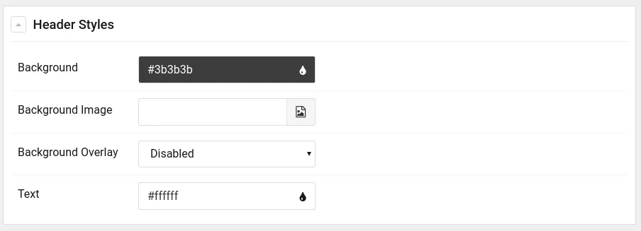

In the previous article Introduction to [Gantry 5: Installation and Configuration](/blog/introduction-to-gantry-5-installation-and-configuration) we saw how to install and configure Gantry in a very basic way, we also learned the basic concepts of this template development framework as well as its administration area.

===

This time we will learn about the file structure of our template, we will learn what each of the different Gantry 5 configuration files are for and how to change the name of our template by modifying several of the main files.

### admin/

It contains several resources used in the Gantry 5 administration area, such as the thumbnail images of each of the presets in our template.

```bash
admin
├── images
│   └── preset1.png
└── templates
 └── pages
 └── about
 └── about.html.twig
```

### blueprints/

Includes configuration schematics for each template-specific style configuration section. By editing the files in this directory we can customize, for example, the controls that allow us to modify the color of the font and/or the background of the section.

In the following configuration file of the "**header**" section, **TEMPLATE/blueprints/styles/header.yaml** we can see an example:

```yaml
name: Header Styles
description: Header section styles for the otherCode theme
type: section
form:
  fields:
    background:
      type: input.colorpicker
      label: Background
      default: "#3b3b3b"
    background-image:
      type: input.imagepicker
      label: Background Image
      default: 'gantry-media://header/pexels-photo-373076.jpeg'
    background-overlay:
      type: select.select
      label: Background Overlay
      description: 'Enables the linear gradient overlay made of accent colors.'
      placeholder: 'Select...'
      default: enabled
      options:
        enabled: Enabled
        disabled: Disabled
    text-color:
      type: input.colorpicker
      label: Text
      default: "#ffffff"
```

The code we see above results in the following controls in the administration area:



Later we will delve into how to edit these files to add the features we want.

```bash
blueprints
└── styles
 ├── accent.yaml
 ├── base.yaml
 ├── main.yaml
 ├── menu.yaml
 ├── navigation.yaml
 ├── offcanvas.yaml
 ├── showcase.yaml
 └── utility.yaml
```

### gantry/

It contains the **presets.yaml** file where the configuration of each of the template presets is stored.

It also contains the file **theme.yaml**, which is the main file of our template, by editing this file we can:

* Change template metadata (name, version, author, platform, icon, etc.).
* Change the style configuration groups of our template.
* Add/remove custom fonts.
* Add/remove block variations (css).
* Modify scss compiler options.

```bash
gantry
├── presets.yaml
└── theme.yaml
```

### layouts/

This directory includes the base schemas in yaml format of each of the outlines that we will manage in the Oulines Manager (Layout Manager). Gantry has three system outlines, which are:

* **Body Only** (_body_only.yaml): It is the schema that models the outlilne that loads only the main body part of our template.
* **Error** (_error.yaml): This file is the one that controls the outline that will be loaded when the system experiences some type of error, such as a 404 page not found error.
* **Offline** (_offline.yaml): In the same way that _error.yaml controls the outline that is displayed when the system experiences a failure, this file controls the outline that will be displayed when the system is offline.

In addition to these system outlines we can have as many outlines as we want, for example an outline for a blog view or an outline for the home view. Later we will create several custom outlines for our template.

```bash
layouts
├── blog.yaml
├── _body_only.yaml
├── default.yaml
├── _error.yaml
├── home.yaml
└── _offline.yaml
```

### particles/

This will be a directory that we will use quite a bit since this is where we will store the particles that our template will use.

Each particle uses at least two files (particle.html.twig and particle.yaml), both of which are stored in this directory.

```bash
particles
├── aboutme.html.twig
├── aboutme.yaml
├── sample.html.twig
└── sample.yaml
```

### scss/

It contains the style files (scss) that are not specific to the platform, that is, it contains the styles of our template. This directory is divided, in turn, into several files and subdirectories.

For example:

```bash
scss
├── configuration
├── template
│   ├── layouts
│   ├── particles
│   ├── sections
│   └── styles
└── template-joomla
 ├── components
 ├── particles
 └── styles
```

### html/

This directory is in all Joomla templates, it is here where the overrides of Joomla extensions are stored, whether they are content plugins, modules and/or components.

```bash
html
├── layouts
│   └── joomla
│       └── system
│           └── message.php
├── mod_simplecontactform
│   ├── default.php
│   └── horizontal.php
└── modules.php
```

### Renaming the template

Now that we know what each of the directories is for, we can start developing our personalized template. The first thing we will do is change the name of the template **g5_hydrogen**, from there we can customize the template 100%.

As we already have a previous installation of the **g5_hydrogen** template that we use as a first contact with the framework, we should delete this installation or make a copy of this template to be able to perform the installation from scratch using the new name.

For this article we will make a copy of the template that we will call "**HGWriter**":

```bash
cp -r templates/g5_hydrogen templates/g5_hgwriter
```

We delete the files compiled with the previous references:

```bash
rm -rf templates/g5_hgwriter/custom/*
```

Now we must rename all the files that contain the term "hydrogen", for this we can use the following line in our terminal:

```bash
find templates/g5_hgwriter/ -name '*hydrogen*'

templates/g5_hgwriter/language/en-GB/en-GB.tpl_g5_hydrogen.sys.ini
templates/g5_hgwriter/language/en-GB/en-GB.tpl_g5_hydrogen.ini
templates/g5_hgwriter/scss/hydrogen.scss
templates/g5_hgwriter/scss/hydrogen
templates/g5_hgwriter/scss/hydrogen-joomla.scss
templates/g5_hgwriter/scss/hydrogen-joomla
```

Once we have identified them we can go one by one renaming them or we can simply use the following command in our terminal:

```bash
for f in $(find templates/g5_hgwriter/ -name '*hydrogen*'); do mv ${f} ${f//hydrogen/hgwriter}; done
```

After executing this command we can verify that the files have been renamed correctly. It is time to change the content of the files that have any reference to the hydrogen template, the differences that we can find are:

* **Hydrogen**
* **hydrogen**
* **HYDROGEN**

To perform this task quickly we will use the following lines:

```bash
for f in $(find templates/g5_hgwriter/ -type f -print0 | xargs -0 grep -m 1 -e "hydrogen" | cut -d ':' -f 1); do sed -i -e 's/hydrogen/hgwriter/g' ${f}; done
for f in $(find templates/g5_hgwriter/ -type f -print0 | xargs -0 grep -m 1 -e "Hydrogen" | cut -d ':' -f 1); do sed -i -e 's/Hydrogen/HGWriter/g' ${f}; done
for f in $(find templates/g5_hgwriter/ -type f -print0 | xargs -0 grep -m 1 -e "HYDROGEN" | cut -d ':' -f 1); do sed -i -e 's/HYDROGEN/HGWRITER/g' ${f}; done
```

It's time to change some meta-data of our template, editing the file **templates/g5_hgwiter/templateDetails.xml**.

```xml
<name>g5_hgwriter</name>
<version>5.4.27</version>
<creationDate>December 14, 2018</creationDate>
<author>Unay Santisteban</author>
<authorEmail>ping.at.othercode.es</authorEmail>
<authorUrl>https://othercode.es</authorUrl>
<copyright>(C) 2007 - 2019 otherCode. All rights reserved.</copyright>
<license>http://www.gnu.org/licenses/gpl-2.0.html GNU/GPLv2</license>
<description>TPL_G5_HGWRITER_DESC</description>
```

We will change this data at will, for example, `<author>`, `<authorUrl>` and `<authorEmail>`, additionally we can change the url of the update server (if we have one) or we can simply delete said section :

```xml
<updateservers>
    <server type="extension" priority="1" name="HGWriter Template">http://updates.gantry.org/5.0/joomla/tpl_g5_hgwriter.xml</server>
</updateservers>
```

Now that we have changed all the files with the new name of our template we can install it in our **Joomla**, to do this we will go to **Extensions > Manage > Discover**:


Finally we select our template and import it by clicking the **Install** button.

Ready! We already have our custom template installed in our **Joomla!**

> If you have any problems during the installation you may have to change the permissions or the owner of the template directory.
