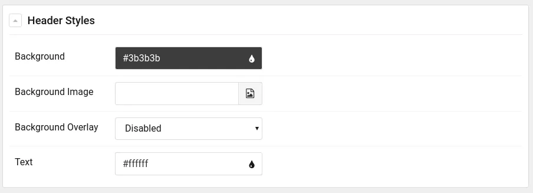
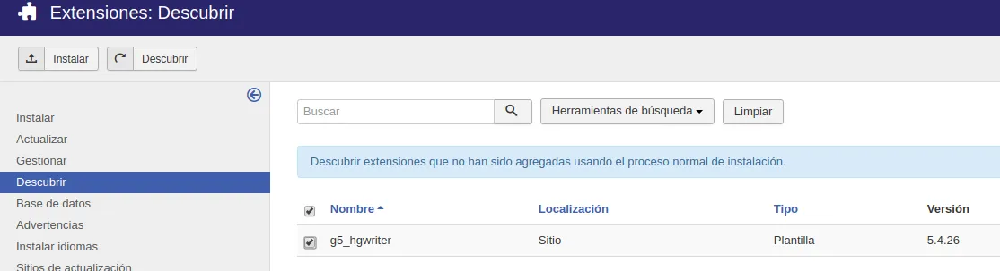

En el artículo anterior [Introducción a Gantry 5: Instalación y Configuración](/blog/introduction-to-gantry-5-installation-and-configuration) vimos como instalar y configurar Gantry de una manera muy básica, además conocimos los conceptos básicos de este framework de desarrollo de plantillas así como su zona de administración.

===

Esta vez conoceremos la estructura de ficheros de nuestra plantilla, aprenderemos para que sirven cada uno de los diferentes archivos de configuración de Gantry 5 y cómo cambiar el nombre de nuestra plantilla modificando varios de los archivos principales.

### admin/

Contiene varios recursos usados en la zona de administración de Gantry 5, como por ejemplo las imágenes thumbnail de cada uno de los presets de nuestra plantilla.

```bash
admin
├── images
│   └── preset1.png
└── templates
 └── pages
 └── about
 └── about.html.twig
```

### blueprints/

Incluye los esquemas de configuración de cada sección de configuración de estilos específicos de la plantilla. Editando los archivos de este directorio podremos personalizar, por ejemplo, los controles que nos permite modificar el color de la fuente y/o el del fondo de la sección.

En el siguiente archivo de configuración de la sección "**header**", **TEMPLATE/blueprints/styles/header.yaml** podemos ver un ejemplo:

```yaml
name: Header Styles
description: Header section styles for the otherCode theme
type: section
form:
  fields:
    background:
      type: input.colorpicker
      label: Background
      default: "#3b3b3b"
    background-image:
      type: input.imagepicker
      label: Background Image
      default: 'gantry-media://header/pexels-photo-373076.jpeg'
    background-overlay:
      type: select.select
      label: Background Overlay
      description: 'Enables the linear gradient overlay made of accent colors.'
      placeholder: 'Select...'
      default: enabled
      options:
        enabled: Enabled
        disabled: Disabled
    text-color:
      type: input.colorpicker
      label: Text
      default: "#ffffff"
```

El código que vemos arriba da como resultado los siguientes controles en la zona de administración:



Más adelante profundizaremos en como editar estos archivos para añadir las características que deseemos.

```bash
blueprints
└── styles
 ├── accent.yaml
 ├── base.yaml
 ├── main.yaml
 ├── menu.yaml
 ├── navigation.yaml
 ├── offcanvas.yaml
 ├── showcase.yaml
 └── utility.yaml
```

### gantry/

Contiene el archivo **presets.yaml** donde se almacena la configuración de cada uno de los presets de la plantilla.

También contiene el archivo **theme.yaml**, que es el archivo principal de nuestra plantilla, editando este archivo podremos:

* Cambiar los metadatos de la plantilla (nombre, versión, autor, plataforma, icono, etc.).
* Cambiar los grupos de configuraciones de estilos de nuestra plantilla.
* Añadir/eliminar fuentes personalizadas.
* Añadir/eliminar variaciones de bloque (css).
* Modificar las opciones del compilador de scss.

```bash
gantry
├── presets.yaml
└── theme.yaml
```

### layouts/

Este directorio engloba los esquemas base en formato yaml de cada uno de los outlines que gestionaremos en el Gestor de Oulines (Layout Manager). Gantry cuenta con tres outlines de sistema, que son:

* **Body Only** (_body_only.yaml): Es el esquema que modela el outlilne que carga solo la parte de main body de nuestra plantilla.
* **Error** (_error.yaml): Este archivo es el que controla el outline que se cargará cuando el sistema experimenta algún tipo de error como por ejemplo un error 404 página no encontrada.
* **Offline** (_offline.yaml): De la misma manera que el _error.yaml controla el outline que se muestra cuando el sistema experimenta un fallo, este archivo controla el outline que se mostrará cuando el sistema esté fuera de linea.

Adicionalmente a estos outlines de sistema podemos tener tantos outlines como queramos, por ejemplo un outline para una vista blog o un outline para la vista home. Más adelante crearemos varios outlines personalizados para nuestra plantilla.

```bash
layouts
├── blog.yaml
├── _body_only.yaml
├── default.yaml
├── _error.yaml
├── home.yaml
└── _offline.yaml
```

### particles/

Este será un directorio que usaremos bastante ya que es aquí donde almacenaremos las partículas que nuestra plantilla usará.

Cada partícula usa al menos dos archivos (particle.html.twig y particle.yaml), ambos se almacenan en este directorio.

```bash
particles
├── aboutme.html.twig
├── aboutme.yaml
├── sample.html.twig
└── sample.yaml
```

### scss/

Contiene los archivos de estilos (scss) que no son específicos de la plataforma, es decir, contiene los estilos propios de nuestra plantilla. Este directorio está dividido, a su vez, en varios archivos y sub-directorios.

Por ejemplo:

```bash
scss
├── configuration
├── template
│   ├── layouts
│   ├── particles
│   ├── sections
│   └── styles
└── template-joomla
 ├── components
 ├── particles
 └── styles
```

### html/

Este directorio está en todas las plantillas de Joomla, es aquí donde se almacenan los overrides de las extensiones de Joomla, ya sean plugins de contenido, módulos y/o componentes.

```bash
html
├── layouts
│   └── joomla
│       └── system
│           └── message.php
├── mod_simplecontactform
│   ├── default.php
│   └── horizontal.php
└── modules.php
```

### Renombrando la plantilla

Ahora que conocemos para que sirve cada unos de los directorios, podemos empezar a desarrollar nuestra plantilla personalizada, lo primero que haremos será cambiarle el nombre a la plantilla **g5_hydrogen**, a partir de ahí podremos personalizar la plantilla al 100%.

Como nosotros ya tenemos una instalación previa de la plantilla **g5_hydrogen** que usamos a modo de primer contacto con el framework, deberíamos eliminar esta instalación o hacer una copia de esta plantilla para poder realizar la instalación desde cero usando el nuevo nombre.

Para este artículo realizaremos una copia de la plantilla que llamaremos "**HGWriter**":

```bash
cp -r templates/g5_hydrogen templates/g5_hgwriter
```

Eliminamos los archivos compilados con las referencias anteriores:

```bash
rm -rf templates/g5_hgwriter/custom/*
```

Ahora debemos cambiar el nombre de todos los archivos que contengan el termino "hydrogen", para esto podemos usar la siguiente línea en nuestra terminal:

```bash
find templates/g5_hgwriter/ -name '*hydrogen*'

templates/g5_hgwriter/language/en-GB/en-GB.tpl_g5_hydrogen.sys.ini
templates/g5_hgwriter/language/en-GB/en-GB.tpl_g5_hydrogen.ini
templates/g5_hgwriter/scss/hydrogen.scss
templates/g5_hgwriter/scss/hydrogen
templates/g5_hgwriter/scss/hydrogen-joomla.scss
templates/g5_hgwriter/scss/hydrogen-joomla
```

Una vez los tenemos identificados podemos ir uno a uno renombrándolos o simplemente podemos usar la siguiente orden en nuestro terminal:

```bash
for f in $(find templates/g5_hgwriter/ -name '*hydrogen*'); do mv ${f} ${f//hydrogen/hgwriter}; done
```

Tras ejecutar este comando podemos comprobar que los archivos se han renombrado correctamente. Es momento de cambiar el contenido de los archivos que tengan alguna referencia a la plantilla hydrogen, las diferencias que podemos encontrarnos son:

* **Hydrogen**
* **hydrogen**
* **HYDROGEN**

Para realizar esta tarea de forma rápida usaremos las siguientes lineas:

```bash
for f in $(find templates/g5_hgwriter/ -type f -print0 | xargs -0 grep -m 1 -e "hydrogen" | cut -d ':' -f 1); do sed -i -e 's/hydrogen/hgwriter/g' ${f}; done
for f in $(find templates/g5_hgwriter/ -type f -print0 | xargs -0 grep -m 1 -e "Hydrogen" | cut -d ':' -f 1); do sed -i -e 's/Hydrogen/HGWriter/g' ${f}; done
for f in $(find templates/g5_hgwriter/ -type f -print0 | xargs -0 grep -m 1 -e "HYDROGEN" | cut -d ':' -f 1); do sed -i -e 's/HYDROGEN/HGWRITER/g' ${f}; done
```

Es turno de cambiar algunos meta-datos de nuestra plantilla, editando el archivo **templates/g5_hgwiter/templateDetails.xml**.

```xml
<name>g5_hgwriter</name>
<version>5.4.27</version>
<creationDate>December 14, 2018</creationDate>
<author>Unay Santisteban</author>
<authorEmail>ping.at.othercode.es</authorEmail>
<authorUrl>https://othercode.es</authorUrl>
<copyright>(C) 2007 - 2019 otherCode. All rights reserved.</copyright>
<license>http://www.gnu.org/licenses/gpl-2.0.html GNU/GPLv2</license>
<description>TPL_G5_HGWRITER_DESC</description>
```

Cambiaremos estos datos a nuestra voluntad, por ejemplo, `<author>`, `<authorUrl>` y `<authorEmail>`, adicionalmente podemos cambiar la url del servidor de actualización (si es que tenemos uno) o simplemente podemos eliminar dicha sección:

```xml
<updateservers>
    <server type="extension" priority="1" name="HGWriter Template">http://updates.gantry.org/5.0/joomla/tpl_g5_hgwriter.xml</server>
</updateservers>
```

Ahora que hemos cambiado todos los archivos con el nuevo nombre de nuestra plantilla podemos instalarla en nuestro **Joomla**, para ello iremos ir a **Extensiones > Gestionar > Descubrir**:



Finalmente seleccionamos nuestra plantilla y la importamos pulsando el botón de **Instalar**.

Listo! ya tenemos nuestra plantilla personalizada instalada en nuestro **Joomla!**

> Si tenéis algún problema durante la instalación puede que tengáis que cambiar los permisos o el propietario del directorio de la plantilla.
> 