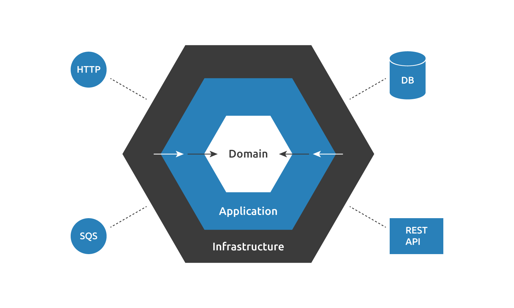

The Hexagonal Architecture, also known as Ports and Adapters Architecture, divides a system into multiple [loosely-coupled](https://en.wikipedia.org/wiki/Loose_coupling) and interchangeable components. Unlike traditional layered architecture, Hexagonal Architecture emphasizes a more flexible and modular approach.

===

> The word "hexagonal" can lead to misinterpretations, since it does not refer to a finite ("six") number of elements.

In this architecture, each component belongs to a specific layer and is connected to other layers through exposed "ports" or contracts. These ports or contracts facilitate communication following specific protocols based on their intended purpose. Ports and protocols define an abstract API that can be implemented using various technical means, allowing for adaptability and ease of integration with external systems.

## Layers

The system is organized into three distinct layers, each serving a specific purpose and encapsulating different aspects of the software.



**Domain Layer**

The concepts that are in our context (Customer, Product, Order, Subscription, User, etc.) and business rules that are determined exclusively by us.

**Application Layer**

The application layer is where the use cases of our application can be found (purchase product, Create new product, customer registration, etc.).

**Infrastructure Layer**

The code that changes based on external decisions (SDK, frameworks, libraries, etc.). In this layer we can find the implementations (_adapters_) of the interfaces (_ports_) that we will define at the domain and application level.

## Dependency Rule

The code within each of our layers should only be acquainted with the classes situated in the immediately adjacent layer. We understand the order of the layers from the outside to the inside:

> **Infrastructure -> Application -> Domain**

This rule provides the possibility of changing elements of our outer layers without affecting the inner ones. For this reason, it makes more sense that the aspects that have the greater variability are in the outermost layer (infrastructure), since they do not depend on us.

> This rule is also know as DIP or [Dependency Inversion Principle](https://en.wikipedia.org/wiki/Dependency_inversion_principle), one of the SOLID Principles.

## Benefits

Now, let's explore some of the advantages provided by this architecture:

1. **Modularity**: Hexagonal Architecture promotes a modular design by clearly separating concerns into layers. This makes it easier to understand, maintain, and extend the system.
2. **Testability**: The clear separation of concerns in Hexagonal Architecture facilitates testing. By isolating the core business logic from external dependencies, such as databases or UI frameworks, it becomes easier to write unit tests and integration tests.
3. **Flexibility**: Hexagonal Architecture enables flexibility in choosing and swapping out implementations. By defining interfaces or contracts (ports) for external dependencies, such as databases or external APIs, different implementations can be plugged in without affecting the core application logic.
4. **Reduced Coupling**: The architecture reduces coupling between components by enforcing a clear boundary between the application core and its external dependencies. This makes the system more maintainable and less prone to unintended side effects when making changes.
5. **Easier Migration**: With Hexagonal Architecture, migrating to new technologies or frameworks becomes easier. Since the core business logic is isolated from external dependencies, changes to infrastructure components can be made without affecting the application logic.
6. **Scalability**: The modular nature of Hexagonal Architecture makes it easier to scale applications as they grow. New features can be added without major modifications to existing code, and new implementations can be introduced to handle increased load or changing requirements.

## How to implement Hexagonal Architecture

Suppose we're developing a fundamental user management application. Within this system, we'll implement a `UserCreateController` and `UserListController` to manage CLI requests associated with users. Additionally, we'll utilize a `UserRepository` to facilitate interactions with the database.

**Define the Domain Entities**

The User entity is quite simple, we just define a unique id and the user name. This belongs to the Domain layer.

```php
final class User  
{  
    public function __construct(  
        private ?int $id,  
        public string $name  
    ) {  
    }
    
    public function id(): ?int  
    {  
        return $this->id;  
    }  
    
    public static function create(string $name): self  
    {  
        return new self(null, $name);  
    }
}
```

**Define the Contract (Interface) for Infrastructure (External) Service**

The repository contract has three methods, `find` which allow us to get a single `User` by ID. The `save` method that persists a `User` into the persistence system, and `all` that allow us to fetch all `User` from the persistence system. This contract belongs to the domain or application layer.

```php
interface UserRepository  
{  
    public function find(int $id): ?User;

	public function all(): array

    public function save(User $user): User;
}
```

**Implement the Application Services**

The finder service is responsible for locating the required `User` by its ID. If the user is not found, this service will raise a domain exception called `UserNotFound`. Since this is an implementation of a business feature, we place it within the application layer.

```php
final readonly class UserFinder  
{  
    public function __construct(  
        private UserRepository $repository  
    ) {  
    }  
    
    public function byId(int $id): User  
    {  
        if (!$user = $this->repository->find($id)) {  
            throw new UserNotFound("User $id not found");  
        }  
        return $user;  
    }
	
	public function all(): array
	{
		return $this->repository->all();
	} 
}
```

The creator is responsible for gathering incoming data and instantiating a new User. Subsequently, it calls the designated repository to persist the user. If an event bus were available to publish events, this would be the appropriate place to invoke it.

```php
final class UserCreator
{
    public function __construct(
        private UserRepository $repository
    ) {
    }

    public function create(string $name): User
    {
        return $this->repository->save(User::create($name));
    }
}
```

**Create the Contract Implementations**

Now is time to implement the actual infrastructure services. For this repository implementation we use [Doctrine](https://symfony.com/doc/current/doctrine.html). 

```php
readonly class DoctrineUserRepository implements UserRepository  
{  
    public function __construct(  
        private EntityManagerInterface $entityManager  
    ) {  
    }
      
    public function find(int $id): ?User  
    {  
        return $this->entityManager->find(User::class, $id);  
    }
     
    public function save(User $user): User  
    {  
        $this->entityManager->persist($user);  
        $this->entityManager->flush();  
  
        return $user;
    }
    
    public function delete(User $user): void  
    {  
        $this->entityManager->remove($user);  
        $this->entityManager->flush();  
    }
}
```

By using Doctrine we cover all the databases supported by this library. 

In this example, `UserFinder` and `UserRepository` are situated within the application layer, while the various implementations of `UserRepository` represent the infrastructure layer. 

**Create the Controllers**

Finally, is time to implement the application controllers.

```php
#!/usr/bin/env php  
<?php

declare(strict_types=1);  
  
require_once "vendor/autoload.php";  
  
use OtherCode\UserManagement\Application\UserCreator;  
use OtherCode\UserManagement\Infrastructure\DoctrineUserRepository;  
  
$repository = new DoctrineUserRepository(require __DIR__.'/../database.php');  
$service = new UserCreator($repository);
  
if (!isset($argv[1])) {  
    echo "Please input name.\n";  
    exit(1);  
}  
  
$user = $service->create($argv[1]);  
  
echo "New user $user->name (#{$user->id()}) created!\n";  
exit(0);
```

The `UserCreateController` and `UserListController` exposes the business logic through a CLI application, but it can be seamlessly replaced, for example, with an HTTP controller. 

Although this component belongs to the infrastructure, as it constitutes the actual "Application" (not the Application Layer), we may organize the code according to the conventions of the framework being used. Note that in this example we have not used any framework, as the purpose was to illustrate how the components are divided into different layers, not to learn to implement Hexagonal Architecture with a particular framework.

Check the code example in the repository [Hexagonal Architecture Example in PHP](https://github.com/othercodes/hexagonal-architecture-example-in-php).

## Conclusion

In summary, Hexagonal Architecture provides a flexible way to design software systems. It breaks the system into separate components, which are easy to replace and interact with. These components are organized into layers - Domain, Application, and Infrastructure - making it easier to understand and maintain the system. The Dependency Rule ensures that changes to one layer don't affect others, making it adaptable and easy to modify. Overall, Hexagonal Architecture is a valuable pattern for modern software development, offering improved flexibility and scalability.