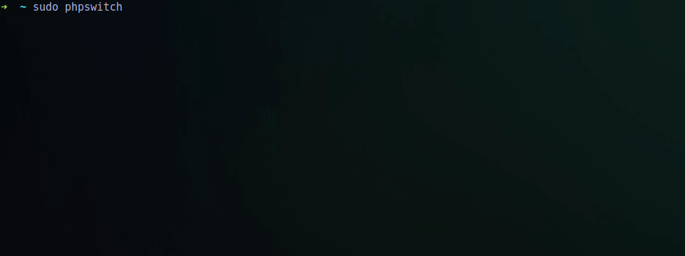

PHP is one of the most widespread web programming languages on the Internet. There are currently three versions in [active support](http://php.net/supported-versions.php), 7.1, 7.2, 7.3 and 7.4 which was released on November 28, 2019. It is advisable to always use the most stable version new, in this case it is 7.4, however, we can install any of these three versions on our system.

===

> Updated with PHP 7.4 and 8.0

First we must activate the [PPA (Personal Package Archive) para las versiones soportadas de PHP](https://launchpad.net/~ondrej/+archive/ubuntu/php):

```bash
sudo apt install python-software-properties
sudo add-apt-repository ppa:ondrej/php
```

Now we have to update the list of available packages, to do this we just have to use the following command:

```bash
sudo apt update
```

Now that we have updated the package lists we can perform the installations:

### PHP 7.1 EOL

```bash
sudo apt install php7.1 libapache2-mod-php7.1 libphp7.1-embed php7.1-{bcmath,bz2,cgi,cli,common,curl,dba,dev,enchant,fpm,gd,gmp,imap,interbase,intl,json,ldap,mbstring,mysql,odbc,opcache,pgsql,phpdbg,pspell,readline,recode,snmp,soap,sqlite3,sybase,tidy,xml,xmlrpc,xsl,zip}
```

### PHP 7.2 EOL

```bash
sudo apt install php7.2 libapache2-mod-php7.2 libphp7.2-embed php7.2-{bcmath,bz2,cgi,cli,common,curl,dba,dev,enchant,fpm,gd,gmp,imap,interbase,intl,json,ldap,mbstring,mysql,odbc,opcache,pgsql,phpdbg,pspell,readline,recode,snmp,soap,sqlite3,sybase,tidy,xml,xmlrpc,xsl,zip}
```

### PHP 7.3

```bash
sudo apt install php7.3 libapache2-mod-php7.3 libphp7.3-embed php7.3-{bcmath,bz2,cgi,cli,common,curl,dba,dev,enchant,fpm,gd,gmp,imap,interbase,intl,json,ldap,mbstring,mysql,odbc,opcache,pgsql,phpdbg,pspell,readline,recode,snmp,soap,sqlite3,sybase,tidy,xml,xmlrpc,xsl,zip} 
```

### PHP 7.4

```bash
sudo apt install php7.4 libapache2-mod-php7.4 libphp7.4-embed php7.4-{bcmath,bz2,cgi,cli,common,curl,dba,dev,enchant,fpm,gd,gmp,imap,interbase,intl,json,ldap,mbstring,mysql,odbc,opcache,pgsql,phpdbg,pspell,readline,recode,snmp,soap,sqlite3,sybase,tidy,xml,xmlrpc,xsl,zip} 
```

### PHP 8.0

```bash
sudo apt install php8.0 libapache2-mod-php8.0 libphp8.0-embed php8.0-{bcmath,bz2,cgi,cli,common,curl,dba,dev,enchant,fpm,gd,gmp,imap,interbase,intl,json,ldap,mbstring,mysql,odbc,opcache,pgsql,phpdbg,pspell,readline,recode,snmp,soap,sqlite3,sybase,tidy,xml,xmlrpc,xsl,zip} 
```

Once we have installed the versions we want, we can use them by directly executing the binaries:

```bash
php7.1 -v
PHP 7.1.25-1+ubuntu16.04.1+deb.sury.org+1 (cli) (built: Dec  7 2018 08:15:15) ( NTS )
Copyright (c) 1997-2018 The PHP Group
Zend Engine v3.1.0, Copyright (c) 1998-2018 Zend Technologies
    with Zend OPcache v7.1.25-1+ubuntu16.04.1+deb.sury.org+1, Copyright (c) 1999-2018, by Zend Technologies
    with Xdebug v2.6.1, Copyright (c) 2002-2018, by Derick Rethans

php7.2 -v
PHP 7.2.13-1+ubuntu16.04.1+deb.sury.org+1 (cli) (built: Dec  7 2018 08:07:08) ( NTS )
Copyright (c) 1997-2018 The PHP Group
Zend Engine v3.2.0, Copyright (c) 1998-2018 Zend Technologies
    with Zend OPcache v7.2.13-1+ubuntu16.04.1+deb.sury.org+1, Copyright (c) 1999-2018, by Zend Technologies
    with Xdebug v2.6.1, Copyright (c) 2002-2018, by Derick Rethans

php7.3 -v
PHP 7.3.0-2+ubuntu16.04.1+deb.sury.org+1 (cli) (built: Dec 17 2018 09:22:12) ( NTS )
Copyright (c) 1997-2018 The PHP Group
Zend Engine v3.3.0-dev, Copyright (c) 1998-2018 Zend Technologies
    with Zend OPcache v7.3.0-2+ubuntu16.04.1+deb.sury.org+1, Copyright (c) 1999-2018, by Zend Technologies
    with Xdebug v2.7.0beta1, Copyright (c) 2002-2018, by Derick Rethans
    
php7.4 -v
PHP 7.4.5 (cli) (built: Apr 19 2020 07:36:30) ( NTS )
Copyright (c) The PHP Group
Zend Engine v3.4.0, Copyright (c) Zend Technologies
    with Zend OPcache v7.4.5, Copyright (c), by Zend Technologies
    with Xdebug v2.9.3, Copyright (c) 2002-2020, by Derick Rethans
```

Finally we can use the `update-alternatives` command to set a given version as the default version:

```bash
sudo update-alternatives --set php /usr/bin/php7.2
```

For our Apache to use a specific version of PHP we must activate the corresponding module and deactivate the ones we do not want:

```bash
sudo a2dismod php7.0
sudo a2dismod php7.1
sudo a2enmod php7.2
```

You can also use this small script to quickly and easily change the PHP version, both from the command line and from Apache.

Source: [phpswitch.sh](https://gist.github.com/othercodes/d249509ac11945ca85b4b95d32ff0109)

