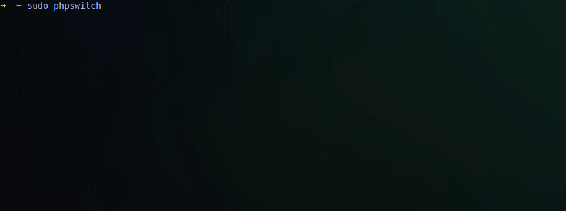

PHP es uno de los lenguajes de programación web mas extendidos en Internet. Actualmente hay tres versiones en [soporte activo](http://php.net/supported-versions.php), 7.1, 7.2, 7.3 y 7.4 que fue lanzada el 28 de Noviembre de 2019. Es recomendable siempre usar la versión estable más nueva, en este caso es la 7.4, sin embargo, podemos instalarnos cualquiera de estas tres versiones en nuestro sistema.

===

> Actualizado con PHP 7.4 y 8.0

Primero debemos activar el [PPA (Personal Package Archive) para las versiones soportadas de PHP](https://launchpad.net/~ondrej/+archive/ubuntu/php):

```bash
sudo apt install python-software-properties
sudo add-apt-repository ppa:ondrej/php
```

Ahora tenemos que actualizar la lista de paquetes disponibles, para ello solo debemos usar la siguiente orden:

```bash
sudo apt update
```

Ahora que hemos actualizado las listas de paquetes podemos realizar las instalaciones:

### PHP 7.1 EOL

```bash
sudo apt install php7.1 libapache2-mod-php7.1 libphp7.1-embed php7.1-{bcmath,bz2,cgi,cli,common,curl,dba,dev,enchant,fpm,gd,gmp,imap,interbase,intl,json,ldap,mbstring,mysql,odbc,opcache,pgsql,phpdbg,pspell,readline,recode,snmp,soap,sqlite3,sybase,tidy,xml,xmlrpc,xsl,zip}
```

### PHP 7.2 EOL

```bash
sudo apt install php7.2 libapache2-mod-php7.2 libphp7.2-embed php7.2-{bcmath,bz2,cgi,cli,common,curl,dba,dev,enchant,fpm,gd,gmp,imap,interbase,intl,json,ldap,mbstring,mysql,odbc,opcache,pgsql,phpdbg,pspell,readline,recode,snmp,soap,sqlite3,sybase,tidy,xml,xmlrpc,xsl,zip}
```

### PHP 7.3

```bash
sudo apt install php7.3 libapache2-mod-php7.3 libphp7.3-embed php7.3-{bcmath,bz2,cgi,cli,common,curl,dba,dev,enchant,fpm,gd,gmp,imap,interbase,intl,json,ldap,mbstring,mysql,odbc,opcache,pgsql,phpdbg,pspell,readline,recode,snmp,soap,sqlite3,sybase,tidy,xml,xmlrpc,xsl,zip} 
```

### PHP 7.4

```bash
sudo apt install php7.4 libapache2-mod-php7.4 libphp7.4-embed php7.4-{bcmath,bz2,cgi,cli,common,curl,dba,dev,enchant,fpm,gd,gmp,imap,interbase,intl,json,ldap,mbstring,mysql,odbc,opcache,pgsql,phpdbg,pspell,readline,recode,snmp,soap,sqlite3,sybase,tidy,xml,xmlrpc,xsl,zip} 
```

### PHP 8.0

```bash
sudo apt install php8.0 libapache2-mod-php8.0 libphp8.0-embed php8.0-{bcmath,bz2,cgi,cli,common,curl,dba,dev,enchant,fpm,gd,gmp,imap,interbase,intl,json,ldap,mbstring,mysql,odbc,opcache,pgsql,phpdbg,pspell,readline,recode,snmp,soap,sqlite3,sybase,tidy,xml,xmlrpc,xsl,zip} 
```

Una vez hemos instalado las versiones que deseemos podemos usarlas ejecutando directamente los binarios:

```bash
php7.1 -v
PHP 7.1.25-1+ubuntu16.04.1+deb.sury.org+1 (cli) (built: Dec  7 2018 08:15:15) ( NTS )
Copyright (c) 1997-2018 The PHP Group
Zend Engine v3.1.0, Copyright (c) 1998-2018 Zend Technologies
    with Zend OPcache v7.1.25-1+ubuntu16.04.1+deb.sury.org+1, Copyright (c) 1999-2018, by Zend Technologies
    with Xdebug v2.6.1, Copyright (c) 2002-2018, by Derick Rethans

php7.2 -v
PHP 7.2.13-1+ubuntu16.04.1+deb.sury.org+1 (cli) (built: Dec  7 2018 08:07:08) ( NTS )
Copyright (c) 1997-2018 The PHP Group
Zend Engine v3.2.0, Copyright (c) 1998-2018 Zend Technologies
    with Zend OPcache v7.2.13-1+ubuntu16.04.1+deb.sury.org+1, Copyright (c) 1999-2018, by Zend Technologies
    with Xdebug v2.6.1, Copyright (c) 2002-2018, by Derick Rethans

php7.3 -v
PHP 7.3.0-2+ubuntu16.04.1+deb.sury.org+1 (cli) (built: Dec 17 2018 09:22:12) ( NTS )
Copyright (c) 1997-2018 The PHP Group
Zend Engine v3.3.0-dev, Copyright (c) 1998-2018 Zend Technologies
    with Zend OPcache v7.3.0-2+ubuntu16.04.1+deb.sury.org+1, Copyright (c) 1999-2018, by Zend Technologies
    with Xdebug v2.7.0beta1, Copyright (c) 2002-2018, by Derick Rethans
    
php7.4 -v
PHP 7.4.5 (cli) (built: Apr 19 2020 07:36:30) ( NTS )
Copyright (c) The PHP Group
Zend Engine v3.4.0, Copyright (c) Zend Technologies
    with Zend OPcache v7.4.5, Copyright (c), by Zend Technologies
    with Xdebug v2.9.3, Copyright (c) 2002-2020, by Derick Rethans
```

Finalmente podemos usar el comando `update-alternatives` para establecer una versión dada, como versión por defecto:

```bash
sudo update-alternatives --set php /usr/bin/php7.2
```

Para que nuestro Apache use una versión específica de PHP debemos activar el módulo correspondiente y desactivar los que no deseemos:

```bash
sudo a2dismod php7.0
sudo a2dismod php7.1
sudo a2enmod php7.2
```

También podéis usar este pequeño script para cambiar de forma fácil y rápida la versión de PHP, tanto de la línea de comandos como de Apache.

Source: [phpswitch.sh](https://gist.github.com/othercodes/d249509ac11945ca85b4b95d32ff0109)

