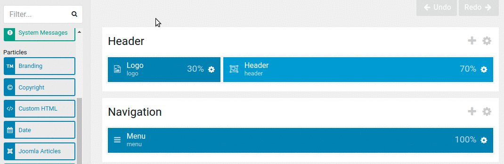

Gantry? What is Gantry? Well, Gantry is a template development framework for Joomla and Wordpress. This framework helps us develop and manipulate the design of our website very quickly. Gantry is developed by RocketTheme and is currently on version 5.4.24.

===

This framework is based on yaml configuration files, which allows us very fast editing, in addition to being able to save the configurations of our templates by copying just a few files.

Before performing the installation, let's learn the basic concepts of Gantry 5:

### Outlines

> A configurable style used in one or more areas of your site. It serves as the container on which a page's style, settings, and layout are set. This is equivalent to a template. This is how Gantry lays out the different elements on a page.

Well, as the official Gantry 5 documentation says, an Outline is a set of settings and styles that define a template. We can have as many Outlines as we want, Gantry 5 has several Outlines by default:

* **Base Outline**: it is the master Outline that all the others inherit from, we can configure almost all the styles shared by our template in this Outline.
* **Body Only**: it is a system Outline and allows us to manipulate only the body of our template.
* **Error**: it is the Outline used by Gantry 5 on error pages such as the mythical 404 page.
* **Offline**: this Outline is used when we have our website in Offline mode (Offline or maintenance mode).

When we talk about **Outline** it is inevitable to talk about inheritance. But what is inheritance? Inheritance is the ability of one object (Outline in our case) to borrow the styles and settings of another object (another outline). This allows us to create outlines without having to configure all aspects of it.

#### Particle

> A typically small block of data used on the front end. It acts a lot like a widget/module, but can be easily configured in the Gantry 5 Administrator.

A particle is a small block of code configured from the Gantry 5 administration and used in the front-end as a module.

#### Atom

> A type of Particle that contains non-rendered data, such as custom scripting (JS, CSS, etc.) or analytics scripts for traffic tracking.

It is a specific type of Particle that does not render any type of view on the front-end and is only used to manage js and css content.

#### Nucleus

> This is Gantry 5’s own front-end framework. It is a very simple and lightweight CSS/SCSS-only framework.

Nucleus is, basically, a set of CSS styles that make up the base styles of Gantry 5. Some of them are:

* bootstrap.css
* font-awesome.css

#### Presets

> Gantry Presets are a combination of Gantry features and configuration settings which allow you to create predefined groupings for the entire template, as well as on a per-menu item basis.

A Preset is a preconfigured **Outline**, with them we can load entire variants of configurations for our template, for example, we can have a preset that uses a range of warm colors and images based on deserts, another preset with cold colors and images from the north pole.

### Facility

Now that we know the basic concepts of Gantry 5, we are going to install it to be able to access its administration panel. The installation is very simple, it consists of a base component (Gantry 5 itself) and the template or templates that we will use on our website. To install it we just have to go to the page gantry.org/downloads and download the package **Gantry 5 Component** and one of the two templates **Helium Theme** or **Hydrogen Theme** for Joomla 3.4+.

Once downloaded we will access **Extensions > Manage > Install Upload Package File [Tab]** and we will upload the previously downloaded packages. We can use any of the Joomla installation methods. I will use the installation via URL.

In this article I will use the **Hydrogen** template for the examples.

### Setting

Gantry 5 has a powerful administration system, with which we can control all aspects of each of our Oulines, from colors, fonts, template structure, particle configuration... We can also control the appearance of the menu. our website and the assignment of styles.

Let's look at all the sections of Gantry Manager 5 one by one.

#### Styles

The **Styles** section is divided into three parts, **preset selector, template specific settings and style settings**. (Personally I find the section names very unintuitive...).

1. Presets Selector

2. Setting template-specific styles

It allows us to manipulate which font we will use on our website, its color, the background color of the website and each area or section of it. All of these controls are configurable and we can add more or eliminate those we don't like at will.

3. Style settings

Here it lets us configure the ranges for the media queries, that is, at what point our website will apply the styles of mobile, tablet, laptop, desktop PC, etc. Additionally, this section gives us the ability to control the animations of the dropdown menu items on our page.

#### Particle Defaults

In this section we can edit the default configuration of all the particles in our template. It is only available in the Base Outline outline, and is useful when you have to change the branding particle or configure social networks. These two particles can be used many times across multiple Outlines and it is quite annoying to have to reconfigure the same data in multiple places over and over again.

#### Page Settings

In this section it allows us to configure the Outline parameters, that is, we can add CSS/JS resources, change the favicon, the touch icon, add custom metatags such as, for example, Facebook's Open Graph tags or Twitter Cards. We can also manipulate the CSS classes and the ID of our body tag.

Furthermore, it is in this section where the Atoms are found, a tremendously useful type of particle, which, as I mentioned before, allows us to manipulate and manage CSS/JS content.

#### Layout Manager

The Layout Manager is the jewel in the crown of Gantry 5, from this section we can manipulate the structure of our page in an easy and fast way, using only the mouse (Drag & Drop).

On the left side is a list of all the particles available in our template. To use them we just have to click on the one we want and drag it to the position we want within the layout.

#### Assignments

In this area we can assign which outline is displayed in each of the links on our website, for example, we can assign an outline called Home on the Home page, another one called Blog for our blog and a different one to the other pages of our website .

To assign, we only have to load the outline we want with the upper left selector and access this section, where all the menus that we have created in our CMS will be shown. Now we just have to activate the outline for the menu items we want.

### Menu Editor

From the menu editor we can customize its appearance and place its different elements to our liking.

For example, we can change the order in which they are displayed or the name of each element, we can also add custom CSS classes or add an image or an icon to our menu item.

### Outlines

The Outlines manager allows us to add, delete, duplicate, etc. the outlines of our spreadsheet.

When creating an outline we must choose where it will be created from, that is, from whom this new outline will inherit, whether from another **outline** or from a **preset**.

Perfect, now that we have installed Gantry 5 with the Hydrogen template and that we already know the administration area roughly, it is time to start developing our website. In future articles I will develop a personal blog step by step, where we will use **particles**, **atoms** and various **outlines**.
