Gantry? Qué es Gantry? Bien, Gantry es un framework de desarrollo de plantillas para Joomla y Wordpress. Este framework nos ayuda a desarrollar y manipular muy rápidamente el diseño de nuestro sitio web. Gantry está desarrollado por RocketTheme y actualmente se encuentra en su versión 5.4.24.

===

Este framework está basado en archivos de configuración yaml lo que nos permite una edición muy rápida, además de poder guardar las configuraciones de nuestras plantillas copiando solo unos pocos archivos.

Antes de realizar la instalación vamos a conocer los conceptos básicos de Gantry 5:

### Outlines

> A configurable style used in one or more areas of your site. It serves as the container on which a page's style, settings, and layout are set. This is equivalent to a template. This is how Gantry lays out the different elements on a page.

Bien, tal y como dice la documentacion oficial de Gantry 5 un Outline es un conjunto de configuraciones y estilos que definen una plantilla. Podemos tener tantos Outlines como queramos, Gantry 5 tiene varios Outlines por defecto:

* **Base Outline**: es el Outline maestro del que todos los demás heredan, podemos configurar casi todos los estilos compartidos por nuestra plantilla en este Outline.
* **Body Only**: es un Outline de sistema y nos permite manipular únicamente el body de nuestra plantilla.
* **Error**: es el Outline usado por Gantry 5 en las páginas de error tales como la mítica página 404.
* **Offline**: éste Outline se usa cuando tenemos nuestra web en modo Offline (Fuera de línea o modo mantenimiento).

Cuando hablamos de **Outline** es inevitable hablar de herencia. Pero, que es herencia? La herencia es la capacidad de un objecto (Outline en nuestro caso) de tomar prestados los estilos y la configuraciones de otro objecto (otro outline). Esto nos permite crear outlines sin tener que andar configurando todos los aspectos de éste.

#### Particle

> A typically small block of data used on the front end. It acts a lot like a widget/module, but can be easily configured in the Gantry 5 Administrator.

Una partícula es un pequeño bloque de código configurado desde la administración de Gantry 5 y usado en front-end a modo de módulo.

#### Atom

> A type of Particle that contains non-rendered data, such as custom scripting (JS, CSS, etc.) or analytics scripts for traffic tracking.

Es un tipo específico de Partícula que no renderiza ningún tipo de vista en el front-end y que sólo se usa para gestionar contenido js y css.

#### Nucleus

> This is Gantry 5’s own front-end framework. It is a very simple and lightweight CSS/SCSS-only framework.

Nucleus es, básicamente, un conjunto de estilos CSS que componen los estilos base de Gantry 5. Algunos de ellos son:

* bootstrap.css
* font-awesome.css

#### Presets

> Gantry Presets are a combination of Gantry features and configuration settings which allow you to create predefined groupings for the entire template, as well as on a per-menu item basis.

Un Preset es un **Outline** preconfigurado, con ellos podemos cargar variantes enteras de configuraciones para nuestra plantilla, por ejemplo, podemos tener un preset que usa una gama de colores cálidos e imágenes basadas en desiertos, otro preset con colores fríos e imágenes del polo norte.

### Instalación

Ahora que conocemos los conceptos básicos de Gantry 5 vamos a instalarlo para poder acceder a su panel de administración.La instalación es muy sencilla, consta de un componente base (Gantry 5 en si) y de la o las plantillas que usaremos en nuestra web. Para instalarlo solo tenemos que ir a la página gantry.org/downloads y descargar el paquete **Gantry 5 Component** y una de las dos plantillas **Helium Theme** o **Hydrogen Theme** para Joomla 3.4+.

 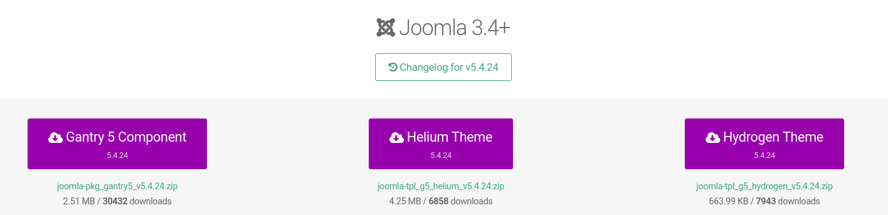

Una vez descargados accederemos a **Extensiones > Gestionar > Instalar Subir archivo del paquete [Pestaña]** y subiremos los paquetes descargados anteriormente. Podemos usar cualquiera de los métodos de instalación de Joomla. Yo usaré la instalación vía URL.

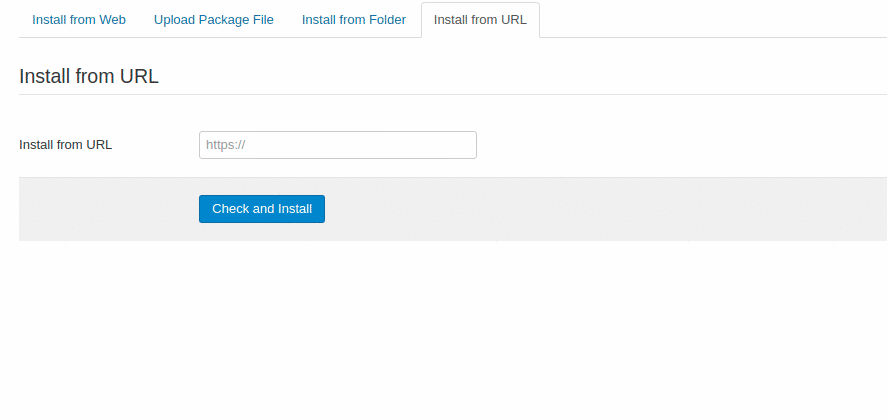

 En este artículo usaré la plantilla **Hydrogen** para los ejemplos.

### Configuración

Gantry 5 cuenta con un potente sistema de administración, con el cual podemos controlar todos los aspectos de cada uno de nuestros Oulines, desde colores, fuentes, estructura de las plantillas, configuración de las partículas... También podemos controlar el aspecto del menú de nuestra web y la asignación de estilos.

Veamos una a una todas las secciones del Administrador de Gantry 5.

#### Styles

La sección **Styles** se divide en tres partes, **selector de presets, configuración específica de la plantilla y configuración de estilos**. (Personalmente encuentro muy poco intuitivos los nombres de las secciones...).

1. Selector de Presets

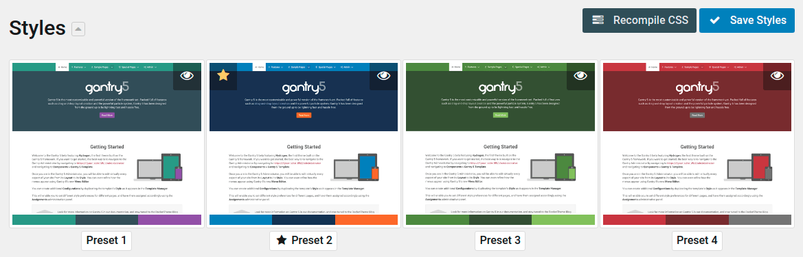

2. Configuración de estilos específicos de la plantilla

Nos permite manipular que fuente usaremos en nuestra web, su color, el color de fondo de la web y de cada zona o sección de esta. Todos estos controles son configurables y podemos añadir más o eliminar los que no nos gusten a voluntad.

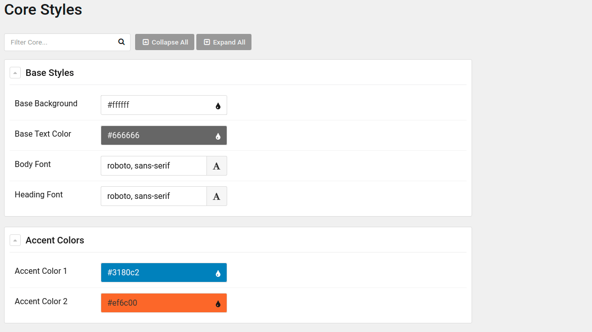

3. Configuración de estilos

Aquí nos deja configurar los rangos para las media queries, es decir, en qué punto nuestra web aplicará los estilos propios de móvil, tablet, portátil, pc de sobremesa, etc. Además, esta sección nos da la posibilidad de controlar las animaciones de los elementos del menú desplegable "dropdown" de nuestra página.

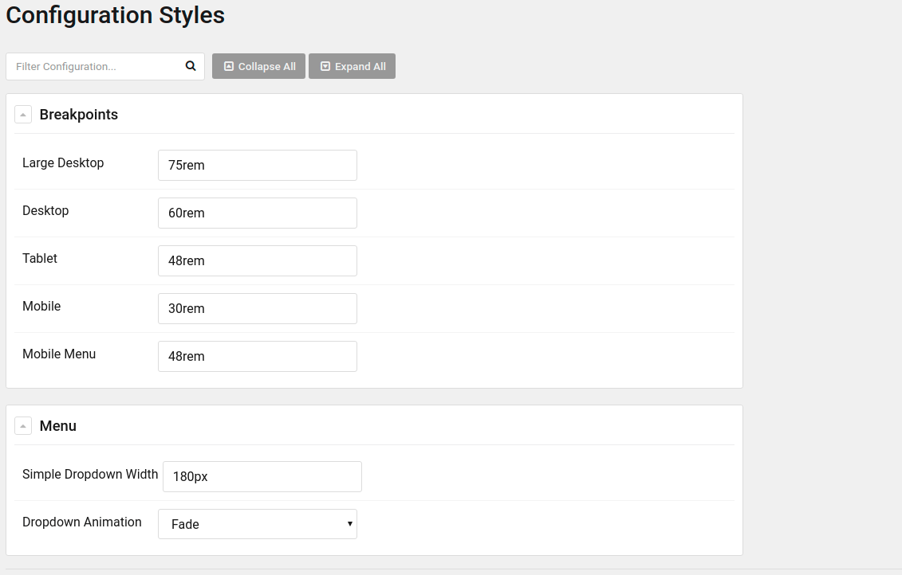

#### Particle Defaults

En esta sección podemos editar la configuración por defecto de todas las partículas de nuestra plantilla. Sólo está disponible en el outline Base Outline, y es útil cuando tienes que cambiar la partícula branding o configurar las redes sociales. Estas dos partículas se pueden usar muchas veces a lo largo de varios Outlines y resulta bastante molesto tener que reconfigurar los mismos datos en varios sitios una y otra vez.

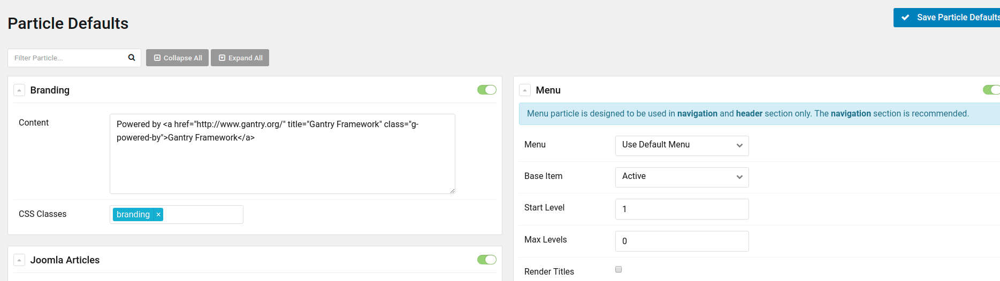

#### Page Settings

En este apartado nos permite configurar los parámetros del Outline, es decir, podremos añadir recursos css/js, cambiar el favicon, el touch icon, añadir metatags customizadas como, por ejemplo, las tag de Open Graph de Facebook o las Twitter Cards. También podremos manipular las clases css y el ID de nuestra etiqueta body. 

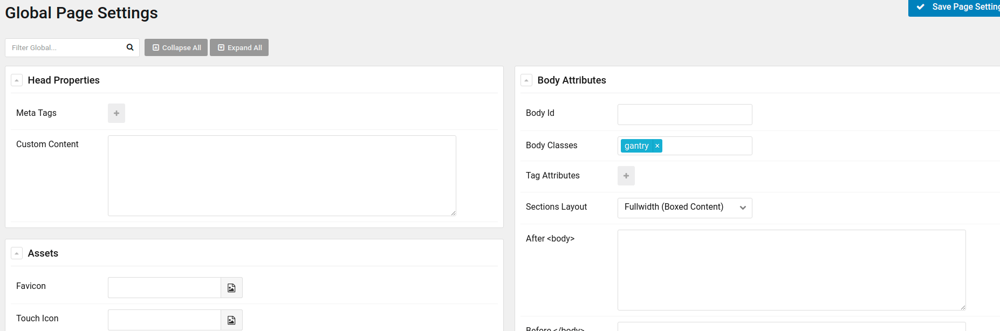

Además, es en esta sección donde se encuentran los Átomos, un tipo de partícula tremendamente útil, qué, como ya comenté antes, nos permite manipular y gestionar contenido css/js.

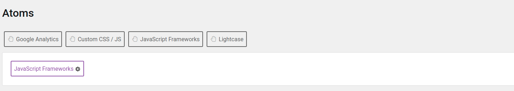

#### Layout Manager

El Layout Manager es la joya de la corona de Gantry 5, desde esta sección podemos manipular la estructura de nuestra página de una manera fácil y rápida, usando solo el ratón (Drag & Drop).

En el lado izquierdo se encuentra una lista de todas las partículas disponibles en nuestra plantilla. Para usarlos solo debemos hacer click en el que queramos y arrastrarlo hasta la posición que deseemos dentro del layout.

 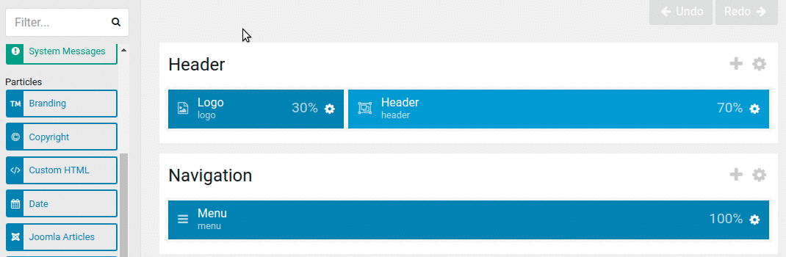

#### Assignments

En esta zona podemos asignar qué outline se muestra en cada uno de los enlaces de nuestra web, por ejemplo, podemos asignar un outline llamado Home en la página de Inicio, otro llamado Blog para nuestro blog y otro diferente a las demás páginas de nuestra web. 

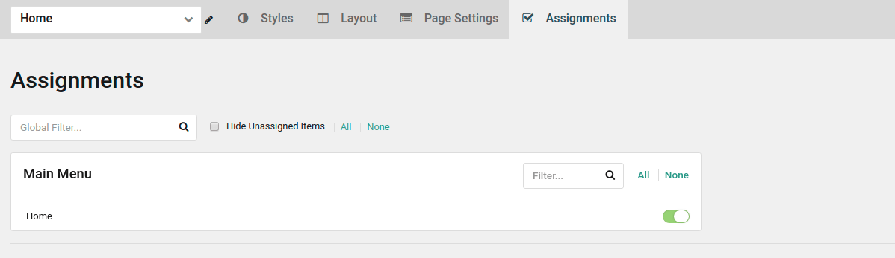

Para asignar solo debemos cargar el outline que deseamos con el selector superior izquierdo y acceder a esta sección, donde se nos mostrarán todos los menús que tengamos creados en nuestro CMS. Ahora solo tenemos que activar el outline para los elementos de los menús que deseemos.

### Menu Editor

Desde el editor de menú podemos personalizar su aspecto y colocar los diferentes elementos de este a nuestro gusto.

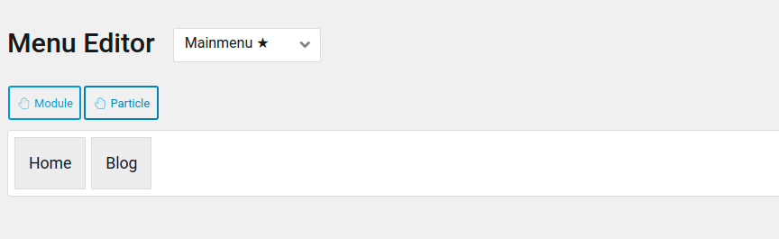

Por ejemplo, podemos cambiar el orden en que se muestran o el nombre de cada elemento, además podemos añadir clases css personalizadas o añadir una imágen o un icono a nuestro elemento del menú.

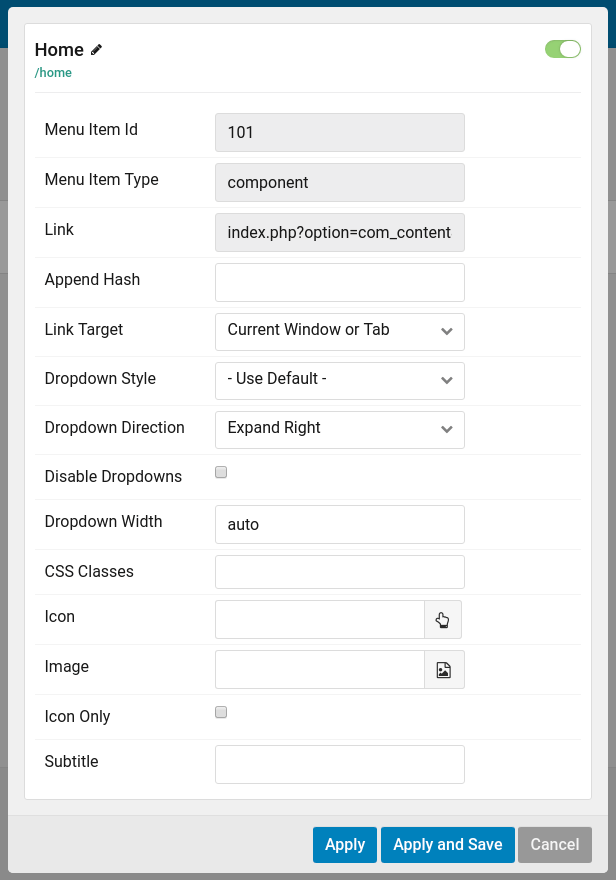

### Outlines

El gestor de Outlines nos permite añadir, eliminar, duplicar, etc. los outlines de nuestra planilla.

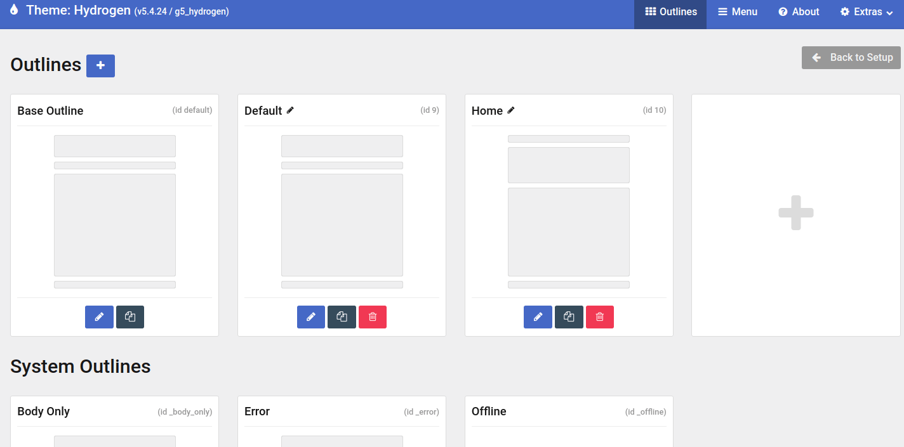

A la hora de crear un outline debemos elegir desde donde se creará, es decir, de quien heredará este nuevo outline, si de otro **outline** o de un **preset**. 

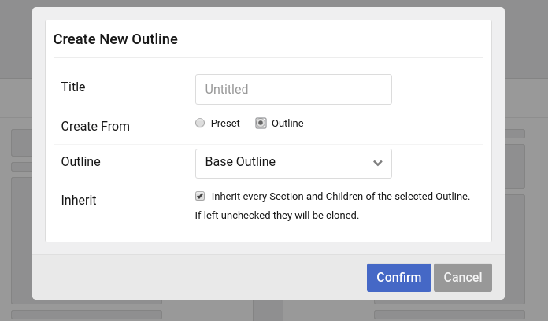

Perfecto, ahora que ya hemos instalado Gantry 5 con la plantilla Hydrogen y que ya conocemos a groso modo la zona de administración, es hora de ponernos a desarrollar nuestro sitio web. En futuros artículos iré desarrollando paso a paso un blog personal, donde usaremos **partículas**, **átomos** y varios **outlines**.