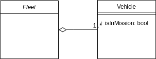
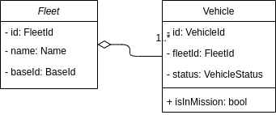

One of the first things you hear when talking about DDD is the term "_Ubiquitous Language_". It is the basis of everything in DDD, using this language we will be able to define all the concepts of our business, it will help us communicate correctly and above all, it will facilitate the task of correctly modeling the domain of our solution.

===

Let's start by defining "<a href="https://dle.rae.es/lenguaje" target="_blank" rel="nofollow">Language</a>":

> Faculty of human beings to express themselves and communicate with others through articulated sound or other sign systems.

Ok, now let's define "<a href="https://dle.rae.es/ubicuo" target="_blank" rel="nofollow">Ubiquitous</a>":

> That is present at the same time everywhere.

Given these two definitions we can assume that a **Ubiquitous Language is a form of communication that is used everywhere**.


Keep quiet, everyone, don't worry. Parts? What parts? Well, parts of our **project**, which could well be **business** and **development** among others.

As we already know, every business has its jargon, its way of defining and naming things. Ubiquitous Language seeks to integrate this jargon efficiently and easily in all areas of the project. So that all members of the interested parties who develop the project call things by the same terms.

## Defining Ubiquitous Language

Suppose we are a software studio that is going to develop an application for a client. He begins to describe his business: "_We are a transport logistics company, we have several fleets of vehicles of different models and characteristics. One or several vehicles or even the entire fleet can go on a mission, that is, be rented by our customers..._".

As we see, the client has used certain terms specific to his business, such as _vehicle_, _fleet_, _vehicle model_, _vehicle characteristic_, _mission_. All of these terms **should** be part of our _ubiquitous language_. In addition to all these nouns, the client can use verbs that define specific actions or operations of their business. Most likely, the nouns will end up being _Entities_ or <a href="index.php?option=com_content&view=article&id=26&catid=8">_Value Objects_</a> and the verbs will end up being _application services_ or _domain services_.

Let's see an example of how to define these entities using UML:



We continue with the conversation, "_What are the characteristics of a fleet?_" we ask, to which the client responds, "_Each fleet is identified by a unique reference, it also has a name and an associated base._". We keep asking, "_What format should the identifier be? and what is a 'base'?_". The client tells us "_The fleet and vehicle identifier is a universal unique identifier. The base is the reference of the physical location where the fleet is parked, it is also a uuid._".

Let's update the previous scheme:



We will continue the conversation until both the client and we are satisfied with the initial model of the solution.

## Implementing Ubiquitous Language

Ubiquitous language is not only limited to communication with our client, it has to be an intrinsic part of the solution we are building, for example:

```php
final class Fleet
{
	private $id;

	private $name;

	private $baseId;

	public function __construct(FleetId $id, FleetName $name, BaseId $baseId)
	{
		$this->id = $id;
		$this->name = $name;
		$this->baseId = $baseId;
	}
}

final class Vehicle
{
	private $id;

	private $fleetId;

	private $status;

	public function __construct(VehicleId $id, FleetId $fleetId, VehicleStatus $status)
	{
		$this->id = $id;
		$this->fleetId = $fleetId;
		$this->status = $status;
	}

	public function isInMission(): bool
	{
		return ($this->status === VehicleStatus::IN_MISSION);
	}
}
```

In this example we see how the code of our solution is full of terms from our ubiquitous language. We have created an `isInMission` method in the `Vehicle` class that directly reflects a concept from our client's business model.

It is advisable to have our ubiquitous language written and fully documented, so that, if in doubt, we can consult any term. Additionally, this will help new team members get familiar with the ubiquitous language.

As we can see, the way to create a ubiquitous language is simple, we just have to talk to our client, assimilate the terminology of their business and apply it to model the domain. It is very important to correctly define an appropriate ubiquitous language, since this will promote correct communication between our client and our development team. If our client tells us that he needs changes in fleet management, we have to know 100% what he is referring to.

Finally, and as a summary we can say that:

- The ubiquitous language seeks to unify communication between all project stakeholders.
- All members of the project's stakeholders must use it fluently.
- Contains terms specific to the business for which the language is being defined.
- It helps us model the domain of our business and easily transfer it to our solution.

